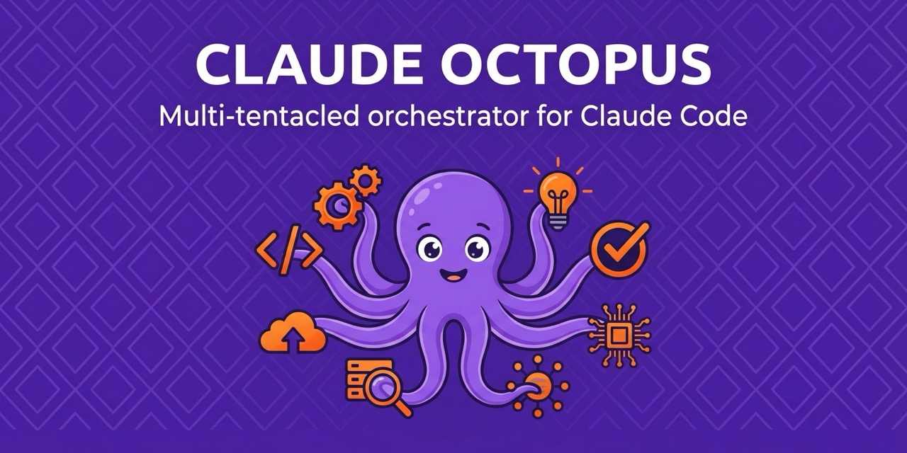

<p align="center">
  
</p>

<p align="center">
  
  
  
  
</p>

# Claude Octopus

**Multi-AI orchestrator for Claude Code** - coordinates Codex, Gemini, and Claude CLIs using Double Diamond methodology.

> *Why have one AI do the work when you can have eight squabble about it productively?* 🐙

## TL;DR

| What It Does | How |
|--------------|-----|
| **Parallel AI execution** | Run multiple AI models simultaneously |
| **Structured workflows** | Double Diamond: Research → Define → Develop → Deliver |
| **Quality gates** | 75% consensus threshold before delivery |
| **Smart routing** | Auto-detects intent and picks the right AI model |
| **Adversarial review** | AI vs AI debate catches more bugs |

**Try it:**
```bash
./scripts/orchestrate.sh auto "build user authentication"
```

---

## Quick Start

### 1. Install

```bash
# Via Claude Code (recommended)
/plugin marketplace add nyldn/claude-octopus

# Or clone directly
git clone https://github.com/nyldn/claude-octopus.git ~/.claude/plugins/claude-octopus
chmod +x ~/.claude/plugins/claude-octopus/scripts/*.sh
```

### 2. Configure

```bash
# Set API keys (add to ~/.zshrc or ~/.bashrc)
export OPENAI_API_KEY="sk-..."
export GEMINI_API_KEY="AIza..."

# Run setup wizard
./scripts/orchestrate.sh setup

# Verify everything works
./scripts/orchestrate.sh preflight
```

### 3. Run

```bash
# Smart auto-routing (recommended)
./scripts/orchestrate.sh auto "build a REST API for users"

# Or full Double Diamond workflow
./scripts/orchestrate.sh embrace "create user dashboard feature"

# Preview without API calls
./scripts/orchestrate.sh -n auto "your prompt"
```

---

## Core Commands

| Command | What It Does |
|---------|--------------|
| `auto <prompt>` | Smart routing - picks best workflow automatically |
| `embrace <prompt>` | Full 4-phase Double Diamond workflow |
| `probe <prompt>` | Research phase - parallel exploration |
| `tangle <prompt>` | Development phase - parallel implementation |
| `grapple <prompt>` | Adversarial debate between AI models |
| `squeeze <prompt>` | Red team security review |
| `setup` | Interactive configuration wizard |
| `preflight` | Verify all dependencies |
| `status` | Show provider status and running agents |

**Common options:** `-n` (dry-run), `-v` (verbose), `-t 600` (timeout), `--cost-first`, `--quality-first`

---

## How It Works

```
     DISCOVER         DEFINE         DEVELOP          DELIVER
     (probe)          (grasp)        (tangle)          (ink)

    \         /     \         /     \         /     \         /
     \   *   /       \   *   /       \   *   /       \   *   /
      \ * * /         \     /         \ * * /         \     /
       \   /           \   /           \   /           \   /
        \ /             \ /             \ /             \ /

   Diverge then      Converge to      Diverge with     Converge to
    converge          problem          solutions        delivery
```

The `auto` command detects your intent and routes to the right phase:

| Keywords | Routes To |
|----------|-----------|
| research, explore, investigate | `probe` (Research) |
| build, implement, create | `tangle` + `ink` (Dev + Deliver) |
| review, test, validate | `ink` (Quality check) |
| security audit, red team | `squeeze` (Security) |
| debate, adversarial | `grapple` (AI vs AI) |

---

<details>
<summary><strong>📋 Prerequisites & Setup Details</strong></summary>

### Required API Keys

| Provider | Get Your Key | Environment Variable |
|----------|-------------|---------------------|
| OpenAI | [platform.openai.com/api-keys](https://platform.openai.com/api-keys) | `OPENAI_API_KEY` |
| Google | [aistudio.google.com/apikey](https://aistudio.google.com/apikey) | `GEMINI_API_KEY` |
| OpenRouter | [openrouter.ai/keys](https://openrouter.ai/keys) | `OPENROUTER_API_KEY` (optional fallback) |

### System Requirements

- **Bash 4.0+** (macOS: `brew install bash`)
- **Codex CLI** - `npm install -g @openai/codex`
- **Gemini CLI** - `npm install -g @google/gemini-cli`
- **Optional:** `jq` for JSON task files

### Environment Setup

```bash
# Add to ~/.zshrc or ~/.bashrc
export OPENAI_API_KEY="sk-..."
export GEMINI_API_KEY="AIza..."
export OPENROUTER_API_KEY="sk-or-..."  # Optional fallback

# Reload shell
source ~/.zshrc
```

### Installation Options

**Via Plugin Marketplace:**
```bash
/plugin marketplace add nyldn/claude-octopus
```

**Clone & Symlink:**
```bash
git clone https://github.com/nyldn/claude-octopus.git ~/git/claude-octopus
ln -s ~/git/claude-octopus ~/.claude/plugins/claude-octopus
chmod +x ~/git/claude-octopus/scripts/*.sh
```

**Update:**
```bash
# If installed via marketplace (recommended):
claude plugin update claude-octopus@nyldn-plugins

# If cloned directly to ~/.claude/plugins/claude-octopus:
cd ~/.claude/plugins/claude-octopus && git pull
```

</details>

<details>
<summary><strong>🔀 Provider-Aware Routing (v4.8)</strong></summary>

Claude Octopus intelligently routes tasks based on your subscription tiers and costs.

### CLI Flags

```bash
--provider <name>     # Force provider: codex, gemini, claude, openrouter
--cost-first          # Prefer cheapest capable provider
--quality-first       # Prefer highest-tier provider
--openrouter-nitro    # Use fastest OpenRouter routing
--openrouter-floor    # Use cheapest OpenRouter routing
```

### Cost Optimization Strategies

| Strategy | Description |
|----------|-------------|
| `balanced` (default) | Smart mix of cost and quality |
| `cost-first` | Prefer cheapest capable provider |
| `quality-first` | Prefer highest-tier provider |

### Provider Tiers

The setup wizard configures your subscription tier for each provider:

| Provider | Tiers | Cost Behavior |
|----------|-------|---------------|
| Codex/OpenAI | free, plus, pro, api-only | Routes based on tier |
| Gemini | free, google-one, workspace, api-only | Workspace = bundled (free) |
| Claude | pro, max-5x, max-20x, api-only | Conserves Opus for complex tasks |
| OpenRouter | pay-per-use | 400+ models as fallback |

**Example:** If you have Google Workspace (bundled Gemini), the system prefers Gemini for heavy analysis since it's "free" with your work account.

```bash
# Check current provider status
./scripts/orchestrate.sh status

# Force cost-first routing
./scripts/orchestrate.sh --cost-first auto "research best practices"
```

</details>

<details>
<summary><strong>🤼 Crossfire: Adversarial Review (v4.7)</strong></summary>

Different AI models have different blind spots. Crossfire forces models to critique each other.

### Grapple - Adversarial Debate

```bash
./scripts/orchestrate.sh grapple "implement password reset API"
./scripts/orchestrate.sh grapple --principles security "implement JWT auth"
```

**How it works:**
```
Round 1: Codex proposes → Gemini proposes (parallel)
Round 2: Gemini critiques Codex → Codex critiques Gemini
Round 3: Synthesis determines winner + final implementation
```

### Squeeze - Red Team Security Review

```bash
./scripts/orchestrate.sh squeeze "implement user login form"
```

| Phase | Team | Action |
|-------|------|--------|
| 1 | Blue Team (Codex) | Implements secure solution |
| 2 | Red Team (Gemini) | Finds vulnerabilities |
| 3 | Remediation | Fixes all issues |
| 4 | Validation | Verifies all fixed |

### Constitutional Principles

| Principle | Focus |
|-----------|-------|
| `general` | Overall quality (default) |
| `security` | OWASP Top 10, secure coding |
| `performance` | N+1 queries, caching, async |
| `maintainability` | Clean code, testability |

</details>

<details>
<summary><strong>💎 Double Diamond Methodology</strong></summary>

### Phase 1: PROBE (Discover)
Parallel research from 4 perspectives - problem space, existing solutions, edge cases, technical feasibility.

```bash
./scripts/orchestrate.sh probe "What are the best approaches for real-time notifications?"
```

### Phase 2: GRASP (Define)
Multi-tentacled consensus on problem definition, success criteria, and constraints.

```bash
./scripts/orchestrate.sh grasp "Define requirements for notification system"
```

### Phase 3: TANGLE (Develop)
Enhanced map-reduce with 75% quality gate threshold.

```bash
./scripts/orchestrate.sh tangle "Implement notification service"
```

### Phase 4: INK (Deliver)
Validation and final deliverable generation.

```bash
./scripts/orchestrate.sh ink "Deliver notification system"
```

### Full Workflow

```bash
./scripts/orchestrate.sh embrace "Create a complete user dashboard feature"
```

### Quality Gates

| Score | Status | Behavior |
|-------|--------|----------|
| >= 90% | PASSED | Proceed to ink |
| 75-89% | WARNING | Proceed with caution |
| < 75% | FAILED | Flags for review |

</details>

<details>
<summary><strong>⚡ Smart Auto-Routing</strong></summary>

The `auto` command extends the right tentacle for the job:

| Tentacle | Keywords | Routes To |
|----------|----------|-----------|
| 🔍 Probe | research, explore, investigate | `probe` |
| 🤝 Grasp | define, clarify, scope | `grasp` |
| 🦑 Tangle | develop, build, implement | `tangle` → `ink` |
| 🖤 Ink | qa, test, validate | `ink` |
| 🤼 Grapple | adversarial, debate | `grapple` |
| 🦑 Squeeze | security audit, red team | `squeeze` |
| 🎨 Camouflage | design, UI, UX | `gemini` |
| ⚡ Jet | fix, debug, refactor | `codex` |
| 🖼️ Squirt | generate image, icon | `gemini-image` |

**Examples:**
```bash
./scripts/orchestrate.sh auto "research caching best practices"    # -> probe
./scripts/orchestrate.sh auto "build the caching layer"            # -> tangle + ink
./scripts/orchestrate.sh auto "security audit the auth module"     # -> squeeze
./scripts/orchestrate.sh auto "fix the cache bug"                  # -> codex
```

</details>

<details>
<summary><strong>🛠️ Optimization Command</strong></summary>

Auto-detect optimization domain and route to specialized agents:

| Domain | Keywords | Agent |
|--------|----------|-------|
| ⚡ Performance | slow, latency, cpu | `codex` |
| 💰 Cost | budget, spend, rightsizing | `gemini` |
| 🗃️ Database | query, index, slow queries | `codex` |
| 📦 Bundle | webpack, tree-shake, minify | `codex` |
| ♿ Accessibility | wcag, a11y, aria | `gemini` |
| 🔍 SEO | meta tags, sitemap | `gemini` |
| 🖼️ Images | compress, webp, lazy load | `gemini` |

```bash
./scripts/orchestrate.sh optimize "My app is slow on mobile"
./scripts/orchestrate.sh optimize "Reduce our AWS bill"
./scripts/orchestrate.sh auto "full site audit"  # All domains
```

</details>

<details>
<summary><strong>🔧 Smart Setup Wizard</strong></summary>

The setup wizard configures Claude Octopus based on your use intent and resource tier.

```bash
./scripts/orchestrate.sh setup
```

### Use Intent (affects persona selection)

| Intent | Default Persona |
|--------|-----------------|
| Backend Development | backend-architect |
| Frontend Development | frontend-architect |
| UX Research | researcher |
| DevOps/Infrastructure | backend-architect |
| Security/Code Review | security-auditor |

### Resource Tier (affects model routing)

| Tier | Plan | Behavior |
|------|------|----------|
| Conservative | Pro/Free | Cheaper models by default |
| Balanced | Max 5x | Smart Opus usage |
| Full Power | Max 20x | Premium models freely |
| Cost-Aware | API Only | Tracks token costs |

```bash
# Reconfigure anytime
./scripts/orchestrate.sh config
```

</details>

<details>
<summary><strong>🔐 Authentication</strong></summary>

### Commands

```bash
./scripts/orchestrate.sh auth status  # Check status
./scripts/orchestrate.sh login        # OAuth login
./scripts/orchestrate.sh logout       # Clear tokens
```

### Methods

| Method | How | Best For |
|--------|-----|----------|
| OAuth | `login` command | Subscription users |
| API Key | Environment variable | API access, CI/CD |

</details>

<details>
<summary><strong>🤖 Available Agents</strong></summary>

| Agent | Model | Best For |
|-------|-------|----------|
| `codex` | GPT-5.1-Codex-Max | Complex code, deep refactoring |
| `codex-standard` | GPT-5.2-Codex | Standard implementation |
| `codex-mini` | GPT-5.1-Codex-Mini | Quick fixes (cost-effective) |
| `gemini` | Gemini 3 Pro | Deep analysis, 1M context |
| `gemini-fast` | Gemini 3 Flash | Speed-critical tasks |
| `gemini-image` | Gemini 3 Pro Image | Image generation |
| `codex-review` | GPT-5.2-Codex | Code review mode |
| `openrouter` | Various | Universal fallback (400+ models) |

</details>

<details>
<summary><strong>📚 Full Command Reference</strong></summary>

### Double Diamond

| Command | Description |
|---------|-------------|
| `probe <prompt>` | Parallel research (Discover) |
| `grasp <prompt>` | Consensus building (Define) |
| `tangle <prompt>` | Quality-gated development (Develop) |
| `ink <prompt>` | Validation and delivery (Deliver) |
| `embrace <prompt>` | Full 4-phase workflow |

### Orchestration

| Command | Description |
|---------|-------------|
| `auto <prompt>` | Smart routing |
| `spawn <agent> <prompt>` | Single agent |
| `fan-out <prompt>` | Multiple agents in parallel |
| `map-reduce <prompt>` | Decompose and parallelize |
| `parallel [tasks.json]` | Execute task file |

### Crossfire

| Command | Description |
|---------|-------------|
| `grapple <prompt>` | Adversarial debate |
| `grapple --principles TYPE` | With domain principles |
| `squeeze <prompt>` | Red team security review |

### Management

| Command | Description |
|---------|-------------|
| `status` | Show running agents |
| `kill [id\|all]` | Terminate agents |
| `clean` | Reset workspace |
| `aggregate [filter]` | Combine results |

### Options

| Option | Default | Description |
|--------|---------|-------------|
| `-p, --parallel` | 3 | Max concurrent agents |
| `-t, --timeout` | 300 | Timeout (seconds) |
| `-v, --verbose` | false | Verbose logging |
| `-n, --dry-run` | false | Preview only |
| `--context <file>` | - | Context from previous phase |
| `--ci` | false | CI mode |

</details>

<details>
<summary><strong>🐛 Troubleshooting</strong></summary>

### Pre-flight fails

```bash
./scripts/orchestrate.sh preflight
# Check: codex CLI, gemini CLI, API keys
```

### Quality gate failures

- Break into smaller subtasks
- Increase timeout: `-t 600`
- Check logs: `~/.claude-octopus/logs/`

### Reset workspace

```bash
./scripts/orchestrate.sh clean
./scripts/orchestrate.sh init
```

### Missing CLIs

```bash
npm install -g @openai/codex
npm install -g @google/gemini-cli
```

</details>

<details>
<summary><strong>📜 What's New</strong></summary>

### v4.8.0 - Subscription-Aware Multi-Provider Routing

- Provider scoring algorithm (0-150 scale)
- Cost optimization: `--cost-first`, `--quality-first`
- OpenRouter integration (400+ models)
- Enhanced setup wizard (9 steps)
- Auto-detection of provider tiers

### v4.7.0 - Crossfire: Adversarial Review

- `grapple` - AI vs AI debate
- `squeeze` - Red team security review
- Constitutional principles system
- Auto-routing for security/debate intents

### v4.6.0 - Claude Code v2.1.9 Integration

- Session tracking, hook system
- Security hardening (path validation, injection prevention)
- CI/CD mode with GitHub Actions support

### v4.5.0 - Smart Setup Wizard

- Intent-based configuration
- Resource tier awareness
- Automatic model routing

[Full Changelog](CHANGELOG.md)

</details>

<details>
<summary>🐙 Meet the Mascot</summary>

```
                      ___
                  .-'   `'.
                 /         \
                 |         ;
                 |         |           ___.--,
        _.._     |0) ~ (0) |    _.---'`__.-( (_.
 __.--'`_.. '.__.\    '--. \_.-' ,.--'`     `""`
( ,.--'`   ',__ /./;   ;, '.__.'`    __
_`) )  .---.__.' / |   |\   \__..--""  """--.,_
`---' .'.''-._.-'`_./  /\ '.  \ _.-~~~````~~~-._`-.__.'
     | |  .' _.-' |  |  \  \  '.               `~---`
      \ \/ .'     \  \   '. '-._)
       \/ /        \  \    `=.__`~-.
       / /\         `) )    / / `"".`\
 , _.-'.'\ \        / /    ( (     / /
  `--~`   ) )    .-'.'      '.'.  | (
         (/`    ( (`          ) )  '-;
          `      '-;         (-'
```

*"Eight tentacles, infinite possibilities."*

</details>

---

## Why Claude Octopus?

| What Others Do | What We Do |
|----------------|------------|
| Single-agent execution | 8 agents working simultaneously |
| Hope for the best | Quality gates with 75% consensus |
| One model, one price | Cost-aware routing to cheaper models |
| Ad-hoc workflows | Double Diamond methodology baked in |
| Single perspective | Adversarial AI-vs-AI review |

---

## License

MIT License - see [LICENSE](LICENSE)

<p align="center">
  🐙 Made with eight tentacles of love 🐙<br/>
  <a href="https://github.com/nyldn">nyldn</a>
</p>
