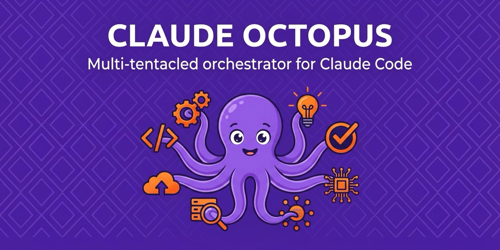

<p align="center">
  
</p>

<p align="center">
  
  
  
  
</p>

# Claude Octopus

**Multi-AI orchestrator for Claude Code** - coordinates Codex, Gemini, and Claude CLIs using Double Diamond methodology.

> *Why have one AI do the work when you can have eight squabble about it productively?* 🐙

Just talk to Claude naturally! Claude Octopus automatically activates when you need multi-AI collaboration:

- 💬 "Research OAuth authentication patterns and summarize the best approaches"
- 💬 "Build a user authentication system"
- 💬 "Review this code for security vulnerabilities"
- 💬 "Run a debate about whether we should use Redis or Memcached"

Claude coordinates multiple AI models behind the scenes to give you comprehensive, validated results.

---

## Quick Start

Get started with Claude Octopus in 2 simple steps:

### Step 1: Install the Plugin

Open Claude Code and run these two commands in the chat:

```
/plugin marketplace add https://github.com/nyldn/claude-octopus
/plugin install claude-octopus@nyldn-plugins
```

The plugin is now installed and automatically enabled.

<details>
<summary>Troubleshooting Installation</summary>

**If `/co:setup` shows "Unknown skill" in Step 2:**

1. Verify the plugin is installed:
   ```
   /plugin list
   ```
   Look for `claude-octopus@nyldn-plugins` in the installed plugins list.

2. Try reinstalling:
   ```
   /plugin uninstall claude-octopus
   /plugin marketplace update nyldn-plugins
   /plugin install claude-octopus@nyldn-plugins
   ```

3. Check for errors in debug logs (from terminal):
   ```bash
   tail -100 ~/.claude/debug/*.txt | grep -i "claude-octopus\|error"
   ```

4. Make sure you're on Claude Code v2.1.10 or later (from terminal):
   ```bash
   claude --version
   ```

**If you see "SSH authentication failed" or "Permission denied (publickey)":**

This means Claude Code tried to use SSH instead of HTTPS. Make sure you used the full HTTPS URL:

```
/plugin marketplace add https://github.com/nyldn/claude-octopus
```

**NOT** the shorthand: `/plugin marketplace add nyldn/claude-octopus` (this triggers SSH)

Alternatively, configure Git to always use HTTPS:
```bash
git config --global url."https://github.com/".insteadOf git@github.com:
```

</details>

### Step 2: Configure Your AI Providers

Run the setup command in Claude Code:
```
/co:setup
```

This will:
- Auto-detect what's already installed
- Show you exactly what you need (you only need ONE provider!)
- Give you shell-specific instructions
- Verify your setup when done

**No terminal context switching needed** - Claude guides you through everything!

### Step 3: Start Using It

Just talk to Claude naturally! Claude Octopus automatically activates when you need multi-AI collaboration:

**For research:**
> "Research microservices patterns and compare their trade-offs"

**For development:**
> "Build a REST API for user management with authentication"

**For code review:**
> "Review my authentication code for security issues"

**For debates:**
> "Run a debate about whether we should use GraphQL or REST for our API"

Claude Octopus automatically detects which providers you have and uses them intelligently.

---

## Latest Release - v7.7.0

**What's New:**

✨ **Standard phase names** - Clearer workflow names: Discover/Define/Develop/Deliver
🎯 **12 new skill commands** - All major workflows accessible via `/co:` commands
🔄 **Enhanced natural language** - Improved triggers for all workflows
🐙 **Integrated parallel-agents** - Consolidated into core plugin for better performance

[View full changelog →](CHANGELOG.md)

---

## Core Features

### 🐙 Multi-AI Orchestration
Run multiple AI models simultaneously for comprehensive, validated results:
- **Parallel execution**: Codex + Gemini + Claude working together
- **Quality gates**: 75% consensus threshold before delivery
- **Smart routing**: Auto-detects intent and picks the right AI model

### 📊 Double Diamond Workflows

Structured problem-solving with four phases:

| Workflow | When to Use | What It Does | Natural Language Trigger |
|----------|-------------|--------------|--------------------------|
| **🔍 Discover** | Research, explore, investigate | Multi-AI research and discovery | "Research OAuth 2.0 patterns" |
| **🎯 Define** | Define, clarify, scope | Requirements and problem definition | "Define requirements for auth system" |
| **🛠️ Develop** | Build, implement, create | Multi-AI implementation with quality gates | "Build user authentication" |
| **✅ Deliver** | Review, validate, audit | Quality assurance and validation | "Review auth code for security" |
| **🐙 Embrace** | Complete feature lifecycle | Full 4-phase Double Diamond workflow | "Build a complete authentication system" |

### 💬 Natural Language First

No commands to memorize - just talk naturally:
- "Research X" → Discover workflow
- "Build X" → Develop workflow
- "Review X" → Deliver workflow
- "Run a debate about X" → AI Debate Hub

### 🎭 Adversarial Review

AI vs AI debate catches more bugs:
- **Debate Hub**: Structured 3-way debates (Claude + Gemini + Codex)
- **Crossfire**: Models critique each other's work
- **Multiple perspectives**: Different models = different blind spots

### 👁️ Visual Feedback

Know what's running and what it costs:
- 🐙 **Parallel Mode** - Multiple CLIs orchestrated (external APIs)
- 🔴 **Codex CLI** - OpenAI Codex (your OPENAI_API_KEY)
- 🟡 **Gemini CLI** - Google Gemini (your GEMINI_API_KEY)
- 🔵 **Claude Subagent** - Built-in Claude Code (no extra cost)

### 🔧 Two Work Modes

Switch between Dev Work and Knowledge Work modes:
- **Dev Mode** (`/co:dev`): Code, test, debug, security audits
- **Knowledge Mode** (`/co:km`): Research, strategy, UX, business analysis

Both modes use the same AI providers but with different personas and quality gates.

---

## Usage Examples

### Research & Discovery
```
💬 "Research OAuth 2.0 authentication patterns and compare their trade-offs"
🐙 Triggers: Discover workflow with multi-AI research
```

### Development & Implementation
```
💬 "Build a REST API for user management with JWT authentication"
🐙 Triggers: Develop workflow with quality gates
```

### Code Review & Quality
```
💬 "Review my authentication code for security vulnerabilities"
🐙 Triggers: Deliver workflow with adversarial review
```

### AI Debates & Decision Making
```
💬 "Run a debate about whether we should use Redis or Memcached for caching"
🐙 Triggers: AI Debate Hub with structured 3-way debate
```

### Complete Feature Workflows
```
💬 "Build a complete notification system with email and push support"
🐙 Triggers: Embrace (full 4-phase: Discover → Define → Develop → Deliver)
```

### Mode-Specific Tasks
```
💬 "Switch to knowledge mode and research market opportunities in fintech"
🐙 Triggers: Knowledge mode + deep research

💬 "Switch to dev mode and debug this authentication issue"
🐙 Triggers: Dev mode + systematic debugging
```

---

## Commands Reference

All commands use the `/co:` namespace (60% shorter than before!):

### System Commands
| Command | Description |
|---------|-------------|
| `/co:setup` | Check setup status and configure AI providers |
| `/co:update` | Check for updates and auto-install |
| `/co:dev` | Switch to Dev Work mode |
| `/co:km` | Toggle Knowledge Work mode |

### Workflow Commands
| Command | Description |
|---------|-------------|
| `/co:discover` | Discovery phase - Multi-AI research |
| `/co:define` | Definition phase - Problem definition |
| `/co:develop` | Development phase - Implementation with quality gates |
| `/co:deliver` | Delivery phase - Quality assurance and validation |
| `/co:embrace` | Full 4-phase Double Diamond workflow |

### Specialized Skills
| Command | Description |
|---------|-------------|
| `/co:debate` | AI Debate Hub - Structured 3-way debates |
| `/co:review` | Expert code review with quality assessment |
| `/co:research` | Deep research with multi-source synthesis |
| `/co:security` | Security audit with OWASP compliance |
| `/co:debug` | Systematic debugging with investigation |
| `/co:tdd` | Test-driven development workflows |
| `/co:docs` | Document delivery (PPTX/DOCX/PDF export) |

**Remember:** You don't need to use commands! Natural language works automatically:
- "Research X" triggers `/co:discover`
- "Build X" triggers `/co:develop`
- "Review X" triggers `/co:deliver`

📖 **[Complete Command Reference →](docs/COMMAND-REFERENCE.md)**

---

## Setup & Configuration

### Installing & Updating

**Install the plugin:**
```
/plugin marketplace add https://github.com/nyldn/claude-octopus
/plugin install claude-octopus@nyldn-plugins
```

**Update to latest version:**
```
/co:update --update
```

Or use Plugin UI: `/plugin` → Installed → claude-octopus → Update

### Configure AI Providers

You only need **ONE** provider (Codex or Gemini):

```
/co:setup
```

This auto-detects what's installed and guides you through setup. Claude Octopus gracefully degrades if only one provider is available.

### Work Modes

**Dev Mode** (default) - Optimized for code:
```
/co:dev
```

**Knowledge Mode** - Optimized for research/strategy:
```
/co:km on
```

### Understanding Costs

**External CLIs use your API quotas:**
- 🔴 Codex CLI: OpenAI API costs (typically $0.01-0.10 per query)
- 🟡 Gemini CLI: Google AI costs (typically $0.01-0.10 per query)

**Claude subagents are included:**
- 🔵 Claude Code Task tool: No additional cost (included with Claude Code)

**When to use external CLIs (🐙):**
- Need multiple perspectives
- High-stakes decisions
- Security/adversarial review

**When to use Claude only:**
- Simple file operations
- Quick edits or fixes
- Cost efficiency important

📖 **[Visual Indicators Guide →](docs/VISUAL-INDICATORS.md)** - Complete cost breakdown

---

## Why Claude Octopus?

| What Others Do | What We Do |
|----------------|------------|
| Single-agent execution | 8 agents working simultaneously |
| Hope for the best | Quality gates with 75% consensus |
| One model, one price | Cost-aware routing and visual feedback |
| Ad-hoc workflows | Double Diamond methodology baked in |
| Single perspective | Adversarial AI-vs-AI review |
| Guess what's running | Visual indicators (🐙 🔴 🟡 🔵) |
| CLI commands only | Natural language triggers workflows |

---

## Documentation

### User Guides
- **[Visual Indicators Guide](docs/VISUAL-INDICATORS.md)** - Understanding what's running and costs
- **[Triggers Guide](docs/TRIGGERS.md)** - What activates each workflow
- **[Command Reference](docs/COMMAND-REFERENCE.md)** - Complete command list
- **[CLI Reference](docs/CLI-REFERENCE.md)** - Direct CLI usage (advanced)

### Developer Guides
- **[Plugin Architecture](docs/PLUGIN-ARCHITECTURE.md)** - How it all works
- **[Contributing Guidelines](CONTRIBUTING.md)** - How to contribute
- **[Migration Guide](docs/MIGRATION-v7.5.md)** - Upgrading from v7.5

### Companion Skills

Claude Octopus includes battle-tested skills for quality:
- 🏗️ **Architecture** - System design and technical decisions
- 🔍 **Code Review** - Comprehensive quality analysis
- 🔒 **Security Audit** - OWASP compliance and vulnerability detection
- 🛡️ **Adversarial Security** - Red team security testing
- 🎯 **Systematic Debugging** - Methodical bug investigation
- ✅ **TDD** - Test-driven development workflows
- 🎯 **Verification** - Pre-completion validation checklist

---

## Version History

**Current: v7.7.0** - Standard phase names, 12 new skill commands

See [CHANGELOG.md](CHANGELOG.md) for complete version history and migration guides.

---

## Acknowledgments

> **Built on the shoulders of giants** 🤝

Claude Octopus stands on the shoulders of these excellent open source projects:

### AI Debate Hub by wolverin0

**[wolverin0/claude-skills](https://github.com/wolverin0/claude-skills)** - AI Debate Hub enables structured three-way debates between Claude, Gemini CLI, and Codex CLI. wolverin0's innovative "Claude as participant" design pattern is brilliant—Claude doesn't just orchestrate, it actively debates.

**Integration**: Git submodule (read-only reference, v4.7)

**Claude-octopus enhancements**:
- Session-aware storage
- Quality gates (75% threshold)
- Cost tracking and analytics
- Document export (PPTX/DOCX/PDF)
- Knowledge mode deliberation

**Usage**: `"Run a debate about whether we should use Redis or in-memory cache"`

**Contributing**: Generic debate improvements → [wolverin0/claude-skills](https://github.com/wolverin0/claude-skills) | Claude-octopus integrations → this repo

### Superpowers by Jesse Vincent

**[obra/superpowers](https://github.com/obra/superpowers)** - Discipline skills (TDD, systematic debugging, verification, planning, branch finishing) inspired by excellent patterns in this Claude Code skills library. The "Iron Law" enforcement approach and anti-rationalization techniques are particularly valuable.

### Double Diamond Methodology

**[UK Design Council](https://www.designcouncil.org.uk/our-resources/the-double-diamond/)** - The Discover/Define/Develop/Deliver workflow structure provides a proven framework for divergent and convergent thinking in design and development.

**All projects use MIT License.**

---

## Contributing

We believe in giving back to the open source community. Here's how you can contribute:

### To Claude-Octopus

1. **Report Issues**: Found a bug? [Open an issue](https://github.com/nyldn/claude-octopus/issues)
2. **Suggest Features**: Have an idea? We'd love to hear it!
3. **Submit PRs**: Improvements welcome—please follow the existing code style
4. **Share Knowledge**: Write about your experience using claude-octopus

### To Upstream Dependencies

When improving claude-octopus, consider whether enhancements benefit the broader community:

**AI Debate Hub (wolverin0/claude-skills)**
- Generic improvements to debate functionality → Submit to [wolverin0/claude-skills](https://github.com/wolverin0/claude-skills)
- Claude-octopus-specific integrations → Keep in this repo
- Examples: Atomic state writes, retry logic, error messages

**Superpowers (obra/superpowers)**
- Improvements to discipline skills → Submit to [obra/superpowers](https://github.com/obra/superpowers)
- Claude-octopus-specific workflows → Keep in this repo

### Contribution Principles

✅ **Do**:
- Maintain clear attribution
- Test thoroughly (95%+ coverage standard)
- Follow existing patterns
- Document your changes
- Consider backward compatibility

❌ **Don't**:
- Break existing workflows
- Remove attribution
- Skip tests
- Introduce unnecessary complexity

### Development Setup

```bash
# Clone with submodules
git clone --recursive https://github.com/nyldn/claude-octopus.git
cd claude-octopus

# Or initialize submodules after cloning
git submodule update --init --recursive

# Run tests
make test

# Run specific test suite
make test-unit
make test-integration
make test-e2e
```

See [CONTRIBUTING.md](CONTRIBUTING.md) for detailed guidelines.

---

## License

MIT License - see [LICENSE](LICENSE)

<p align="center">
  🐙 Made with eight tentacles of love 🐙<br/>
  <a href="https://github.com/nyldn">nyldn</a>
</p>
