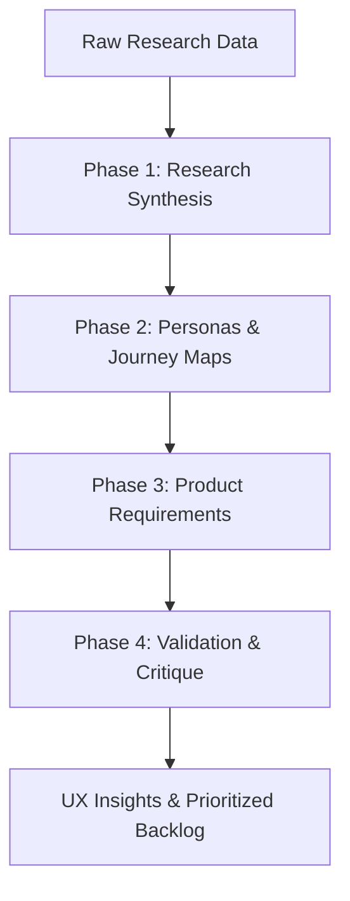
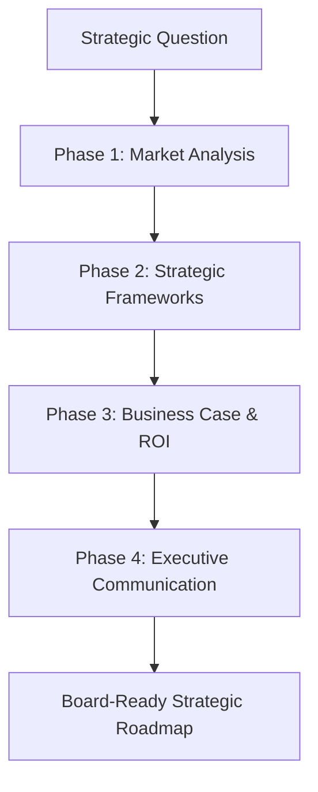
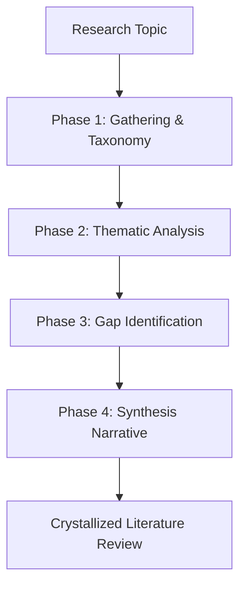

# Claude Octopus Knowledge Worker Guide

> *Extending knowledge tentacles into research, strategy, and synthesis. Because your brain needs eight extra arms.* 🐙

---

## Introduction

Claude Octopus v6.0 introduces **Knowledge Work Mode**, a specialized suite of workflows and agents designed for researchers, consultants, product managers, and academic writers. While the core of Claude Octopus remains rooted in elite software engineering, these new features acknowledge that "development" begins long before the first line of code and continues long after the PR is merged.

Traditional AI coding assistants focus on the "Tangle" (Develop) phase. Claude Octopus v6.0 recognizes that high-value output requires a deep "Probe" (Discover) and "Grasp" (Define) phase—especially when the deliverable isn't just code, but a strategic decision or a synthesized body of knowledge.

Whether you are synthesizing user interviews, architecting a market entry strategy, or weaving together 50 academic papers into a coherent literature review, the knowledge tentacles of Claude Octopus are designed to handle the heavy lifting of information processing.

---

## Quick Start

### Enable Knowledge Work Mode
Knowledge Work Mode is a global toggle that shifts the "brain" of the Octopus to prioritize research and strategy analysis over code generation. You can toggle it on or off with a single command:

```bash
./scripts/orchestrate.sh knowledge-toggle
```

When enabled, the `auto` command will interpret ambiguous requests (like "Review this document") as knowledge tasks rather than code review tasks.

### Basic Commands
Each knowledge workflow can be triggered directly, bypassing the need for auto-routing:

| Command | Goal | Primary Tentacle | Phase Count |
|---------|------|------------------|-------------|
| `empathize <prompt>` | UX Research Synthesis | `ux-researcher` | 4 Phases |
| `advise <prompt>` | Strategic Consulting | `strategy-analyst` | 4 Phases |
| `synthesize <prompt>` | Literature Review | `research-synthesizer` | 4 Phases |

---

## The Three Knowledge Workflows

Claude Octopus uses multi-phase, multi-agent pipelines to ensure depth and accuracy in knowledge work. Each phase is a "checkpoint" where different agents critique and build upon the work of the previous phase.

### 🎯 Empathize (UX Research)
*Understanding users through multiple tentacles.*

The Empathize workflow is designed for the "Discover" phase of the Double Diamond. It transforms raw research data into actionable design requirements.



#### Phase 1: Research Synthesis (Gemini)
The `ux-researcher` agent analyzes raw transcripts, notes, and data points.
- **Goal**: Identify key user insights and recurring patterns.
- **Output**: Thematic clusters and ranked pain points.

#### Phase 2: Personas & Journey Maps (Gemini)
The agent uses the synthesis to create evidence-based artifacts.
- **Goal**: Humanize the data into archetypes.
- **Output**: 2-3 distinct user personas and a current-state journey map.

#### Phase 3: Product Requirements (Codex)
The `product-writer` agent translates insights into engineering-ready language.
- **Goal**: Bridge the gap between research and development.
- **Output**: User stories, acceptance criteria, and success metrics.

#### Phase 4: Validation & Critique (Gemini)
An adversarial review phase where the `ux-researcher` challenges the requirements.
- **Goal**: Spot biases, overlooked segments, or "requirement creep."
- **Output**: Constructive critique and prioritization recommendations.

---

### 📊 Advise (Strategic Consulting)
*Wrapping strategic tentacles around the problem.*

The Advise workflow is designed for high-stakes decision support. It treats your prompt as a "Case" and applies management consulting rigor to the solution.



#### Phase 1: Market & Competitive Analysis (Gemini)
The `strategy-analyst` maps the environment.
- **Goal**: Quantify the opportunity and landscape.
- **Output**: Market sizing (TAM/SAM/SOM), competitor matrix, and industry trends.

#### Phase 2: Strategic Frameworks (Gemini)
The agent applies proven mental models to the data.
- **Goal**: Structure the "chaos" of market data.
- **Output**: SWOT Analysis, Porter’s Five Forces, and a trade-off matrix.

#### Phase 3: Business Case & ROI (Codex)
The agent builds the financial and logical rationale.
- **Goal**: Prove why a specific path is the best investment.
- **Output**: ROI models, risk assessment, and a 90-day action plan.

#### Phase 4: Executive Communication (Gemini)
The `exec-communicator` distills the entire analysis.
- **Goal**: Get approval from senior stakeholders.
- **Output**: 1-page executive summary and board-ready talking points.

---

### 📚 Synthesize (Academic Research)
*Weaving knowledge tentacles through the literature.*

The Synthesize workflow handles the massive context windows required for academic and technical research. It is ideal for "State of the Art" reviews.



#### Phase 1: Gathering & Taxonomy (Gemini)
The `research-synthesizer` organizes the field.
- **Goal**: Define the boundaries of the research.
- **Output**: Sub-topic taxonomy, theoretical frameworks, and seminal works list.

#### Phase 2: Thematic Analysis (Gemini)
The agent analyzes points of consensus and friction.
- **Goal**: Move beyond chronological summaries to conceptual understanding.
- **Output**: Thematic matrix and evolution-of-thinking timeline.

#### Phase 3: Gap Identification (Codex)
The agent looks for what is *missing* from the body of work.
- **Goal**: Identify the "Frontier" for new research.
- **Output**: Methodological limitations and priority research questions.

#### Phase 4: Synthesis Narrative (Gemini)
The `academic-writer` drafts the formal review.
- **Goal**: Create a publishable or citation-ready document.
- **Output**: Structured narrative with critical synthesis and formal tone.

---

## Specialized Knowledge Agents

These tentacles are the backbone of v6.0. Use them individually with the `spawn` command for targeted tasks.

### 🧠 ux-researcher
- **Model**: `opus` (Maximum empathy and reasoning)
- **When to Use**: Analyzing interview transcripts, heuristic evaluations, or persona development.
- **Superpower**: Distinguishing between user observation and interpretation.
- **Avoid If**: You need visual UI design; use `frontend-developer` instead.
- **Example Prompt**: *"Synthesize these 12 interview transcripts into an affinity map of pain points."*

### 📈 strategy-analyst
- **Model**: `opus` (Maximum business logic)
- **When to Use**: Competitive intelligence, SWOT analysis, market sizing.
- **Superpower**: Applying complex frameworks (BCG Matrix, Ansoff) to messy data.
- **Avoid If**: You need technical implementation details; use `backend-architect`.
- **Example Prompt**: *"Analyze the competitive landscape for AI coding assistants using Porter's Five Forces."*

### 🔬 research-synthesizer
- **Model**: `opus` (Maximum pattern matching)
- **When to Use**: Systematic reviews, literature synthesis, annotated bibliographies.
- **Superpower**: Finding points of consensus across contradictory sources.
- **Avoid If**: You need statistical analysis; use specialized data tools.
- **Example Prompt**: *"Identify the primary research gaps in current LLM safety literature."*

### ✍️ academic-writer
- **Model**: `sonnet` (Fast, formal, precise)
- **When to Use**: Drafting papers, grant proposals, abstracts, or peer review responses.
- **Superpower**: Maintaining a formal academic register without being wordy.
- **Avoid If**: You are writing marketing copy; use `exec-communicator`.
- **Example Prompt**: *"Draft a 250-word abstract for my paper on machine learning fairness."*

### 👔 exec-communicator
- **Model**: `sonnet` (Maximum impact per word)
- **When to Use**: Executive summaries, board presentations, stakeholder updates.
- **Superpower**: The "Pyramid Principle"—leading with conclusions.
- **Avoid If**: You haven't done the analysis yet; use `strategy-analyst` first.
- **Example Prompt**: *"Create a 1-page executive summary of our Q2 technical debt audit."*

### 📝 product-writer
- **Model**: `sonnet` (Maximum requirement precision)
- **When to Use**: Writing PRDs, user stories, acceptance criteria, or release notes.
- **Superpower**: Given-When-Then BDD formatting.
- **Avoid If**: You are still in user research; use `ux-researcher`.
- **Example Prompt**: *"Write 10 user stories with acceptance criteria for our new mobile onboarding flow."*

---

## Smart Routing & Intent

Knowledge work behavior is heavily influenced by your configuration.

### Selection of Intent
When you run `./scripts/orchestrate.sh config`, you can select specialized intents (choices 11, 12, 13) which sets your default persona and primary companion.

| Choice | Intent | Default Companion |
|--------|--------|-------------------|
| **[11]** | **Strategy/Consulting** | `strategy-analyst` |
| **[12]** | **Academic Research** | `research-synthesizer` |
| **[13]** | **Product Management** | `product-writer` |

### Knowledge Work Mode Toggle
Setting `KNOWLEDGE_WORK_MODE="true"` (via `knowledge-toggle`) changes the following:
1.  **Keyword Sensitivity**: Keywords like "review" trigger `code-reviewer` when OFF, but trigger `exec-communicator` or `ux-researcher` when ON.
2.  **Phase Preference**: `auto` will prefer running `empathize` over `probe` for research tasks.
3.  **Persona Tuning**: Personas are injected with "information density" instructions rather than "code correctness" instructions.

---

## Workflow Customization

You can customize the depth and focus of any knowledge workflow by adding specific constraints to your prompt.

### Customizing Frameworks
By default, the `advise` workflow uses standard management consulting frameworks. You can override these:
- `advise "Should we pivot?" --use-frameworks "Blue Ocean Strategy, 7S Framework"`
- `advise "Market entry" --focus "Geopolitical risk analysis"`

### Adjusting Synthesis Granularity
The `synthesize` workflow can be tuned for breadth or depth:
- `synthesize "Edge computing" --breadth high` (Scans a wide range of sub-topics)
- `synthesize "Edge computing" --depth critical` (Deep-dives into the 3 most controversial papers)

### Persona-Driven Critiques
Use the `grapple` command to have two different knowledge agents debate a topic:
- `grapple "What is our 2026 product strategy?" --persona1 strategy-analyst --persona2 product-writer`
This forces a debate between high-level business strategy and low-level product feasibility.

---

## Troubleshooting Knowledge Workflows

**1. "Context window exceeded"**
Knowledge work often involves massive amounts of text. If you hit context limits:
- Break your input into smaller chunks.
- Use the `gemini` CLI as your primary provider (1M+ context window).
- Run `synthesize` on individual themes first, then aggregate.

**2. "Insights seem too generic"**
This usually happens when the raw research data provided is too thin.
- Provide direct quotes or transcript excerpts.
- Use the `ux-researcher` agent directly to "interrogate" the data: `spawn ux-researcher "What are the contradictions in these 5 interviews?"`

**3. "Adversarial review is too aggressive"**
In Phase 4 of Empathize, the agent is trained to be highly critical to avoid groupthink.
- If the critique is too harsh, you can dial it back in your prompt: `empathize "..." --critique-tone constructive`.

---

## FAQ

**Q: Can these workflows handle PDF or Office files?**
A: Yes, if you use the `pdf`, `docx`, or `xlsx` companion skills. These skills will extract the text and feed it into the knowledge workflows.

**Q: Which model is best for knowledge work?**
A: We recommend **Gemini 3 Pro** for Phases 1 and 2 (due to the 1M+ context window) and **Claude Opus** for Phase 3 (due to reasoning depth).

**Q: How do I get my data into the Octopus?**
A: You can paste text directly into the prompt, reference local files (e.g., `empathize "Analyze transcripts in ./docs/interviews/"`), or use the `webfetch` tool to pull research from URLs.

**Q: Can I run knowledge work in CI/CD?**
A: Yes! Use the `--ci` flag. This is useful for automatically generating release notes (`product-writer`) or summarizing research papers added to a repository.

---

## Comparison: Knowledge vs. Development

| Feature | Development Workflows (`probe`/`tangle`) | Knowledge Workflows (`empathize`/`advise`) |
|---------|------------------------------------------|--------------------------------------------|
| **Primary Goal** | Working software & system design | Validated insights & business strategy |
| **Deliverables** | Code, tests, diagrams, API specs | Reports, summaries, PRDs, research papers |
| **Primary CLI** | `codex` (Elite code generation) | `gemini` (1M+ context analysis) |
| **Validation** | Unit tests, quality gates, security audits | Adversarial critique, executive review |
| **Tone** | Technical, functional, precise | Strategic, analytical, persuasive |
| **Diamond Phase** | Grasp (Define) & Tangle (Develop) | Probe (Discover) & Grasp (Define) |

---

## Real-World Case Studies

### Case Study A: The Rapid PRD
**Scenario**: A PM needs to turn 10 hours of user interviews into a spec by tomorrow morning.
**Workflow**: `empathize "Synthesize transcripts in /data/interviews and draft a PRD for the mobile redesign."`
**Outcome**: A 4-phase execution result where the Octopus produces a synthesis report, user personas, a 15-story product backlog, and a critical risk assessment.

### Case Study B: The Board Strategy
**Scenario**: A CTO needs to justify a multi-million dollar migration from AWS to on-premise.
**Workflow**: `advise "Build a business case for migrating our core workloads from cloud to on-premise, focusing on 3-year TCO and data sovereignty."`
**Outcome**: A comprehensive strategic analysis including a PESTLE assessment of data laws, a 3-year ROI model, and a high-impact executive summary.

---

## Quick Links

- **Agent Catalog:** [AGENTS.md](AGENTS.md)
- **Main README:** [../README.md](../README.md)
- **Visual Decision Trees:** [agent-decision-tree.md](agent-decision-tree.md)
- **Analytics Dashboard:** `orchestrate.sh analytics`

---

<p align="center">
  🐙 <em>"Because thinking is just development of the mind."</em> 🐙
</p>
