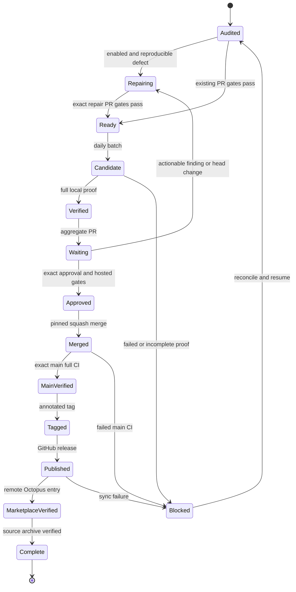

# Maintainer queue and release automation

This document designs hourly GitHub queue checks and one daily release batch.
The controller, repair dispatcher, publishing stages and timers described here
are **not implemented or activated** by this document. Installing the plugin
continues to make no scheduled GitHub writes or recurring provider calls.
Activation requires the implementation and acceptance work below, followed by
explicit maintainer authorization.

The design follows [RELEASING.md](../RELEASING.md). A trusted Forge controller
coordinates work; isolated workers propose fixes; independent reviewers approve
the exact commits; a separate publisher performs the authorized GitHub and
marketplace writes.

## Cadence and ownership

The controller checks the configured public and private issue/PR queues every
hour at **:17 UTC**. It records complete snapshots, queues reproducible defects
for bounded repair, and monitors existing review and CI activity. Read-only audit
is the default. Repair, merge and publication each require explicit host-local
opt-in; an audit does not silently start a provider session.

At **05:43 UTC each day**, the controller selects ready work for one combined
branch and PR. It retains contributor attribution and fixing-issue links. It
merges and publishes that batch only after all gates pass. If nothing is ready,
it creates no version, tag or release. A batch still waiting for review remains
open; the next daily tick resumes it rather than creating a competing release.
Hourly repairs do not cut individual releases.

One host lock covers controller decisions and publication. Hourly ticks during
an active operation record a pending audit; the next lock holder catches up.
An interrupted or delayed tick cannot erase work: the durable journal records
the outstanding batch independently of the scheduler. A pause blocks new
workers and mutations; an emergency stop terminates worker process groups and
leaves recovery receipts intact.

The existing [work-queue hook](../hooks/github-work-queue-watch.sh) is opt-in,
prompt-triggered context with a six-hour default debounce and limited summaries.
The [Octopus scheduler](SCHEDULER.md) supplies workflow admission, timeouts,
process-group termination and cost estimates. Neither currently implements this
controller. Existing host timers must be inventoried and reconciled during
deployment, including any enabled but inactive queue timer; this design changes
none of them.

## Trust and credentials

| Component | Authority | Isolation requirement |
| --- | --- | --- |
| Auditor/controller | Read configured queues, refs, reviews and CI; maintain journal and dispatch policy | Trusted, pinned controller code; host-local lock and private state |
| Repair worker | Modify an owned checkout and run bounded tests; return patch, commit and evidence | Disposable OS boundary; no GitHub, marketplace or private-handoff write credentials; no writable controller state or host home |
| Independent reviewer | Review the proposed exact commit, verify evidence, submit approval | Identity distinct from repair author and publisher; complete comment/thread inspection |
| Publisher | Push approved branch, post validated text, merge, tag, publish and sync the Octopus marketplace entry | Separate trusted process with least-scoped host-local credentials; no agent tool access to those credentials |

Issue bodies, PR code, comments and artifacts are untrusted data. Pass them as
structured input or files, never shell fragments. Workers invoke a pinned trusted
Octopus/harness installation, not an executable supplied by the issue or fork.
Contributor code and tests run only inside the disposable worker boundary.
Provider credentials needed for an explicitly enabled repair are separate from
publication credentials and confined to that worker's approved provider scope.

Tool allowlists, workspace hooks, `setsid` and cost polling are useful controls;
they do not establish OS isolation or a hard spending ceiling. Before enabling
repairs, prove the worker cannot read publisher credentials or mutate host state,
and verify provider readiness, process-tree timeout, finite retry/turn policy,
daily admission budget and a hard provider/CLI spending bound where available.
Failure to prove these properties leaves repair disabled. An installed CLI does
not prove an authenticated task will work. On Forge, Codex's nested sandbox
inside the current Bubblewrap launch boundary is blocked by host namespace
policy. Native Codex outside that boundary has separate startup-guide coverage.
Worker activation requires proof of its actual configured isolation path; do not
bypass the sandbox to activate this design.

Publication credentials belong in a protected host credential store or separately
scoped GitHub App installation, never committed files, issue text, provider
prompts or logs. Grant read access to the auditor and endpoint-specific writes
only to the publisher, including separate access to the marketplace repository.
Never expose a long-lived Forge publisher runner to fork code or use privileged
`pull_request_target` execution to test it. GitHub documents least permissions,
script injection and self-hosted runner risks in its
[secure-use reference](https://docs.github.com/en/actions/reference/security/secure-use).

## Hourly discovery and repair

An audit fully paginates open issues and PRs for every configured repository,
then each relevant issue comment, review, inline review comment, review thread
and nested thread-comment connection. It captures current refs, review state,
check runs, commit statuses, workflow run/attempt identities and applicable
branch/ruleset requirements. REST issue lists include PR records; partition them
instead of treating every result as an issue. API errors, inconsistent counts,
missing cursors, incomplete pagination and pending automated reviews produce a
blocked receipt, not an empty queue. Check `totalCount` against collected nodes
where the API exposes it, including each nested thread-comment connection.

A suspected defect enters the repair queue with its exact source head and a
reproduction goal. A worker demonstrates the failure, makes a bounded fix and
records the same control passing. Security-sensitive repairs include negative
or mutation controls for the claimed protection. A failed source test blocks
admission; a missing optional runtime is reported as skipped, never passed.
Attempt, time, cost and concurrency limits bound retries. An inconclusive task
returns for maintainer triage rather than repeatedly spending or closing it.

The publisher can open a tested repair PR with a validated body. Admission into
the daily batch requires that PR's independent approval on its current head,
zero unresolved threads and current successful CI. New comments are assessed
before admission; actionable findings return the PR to repair. The controller
cannot manufacture approval, self-approve or resolve another reviewer's concern
merely because its own test passed.

Fixed issues close only after an accepted merged fix proves the issue was
addressed. Invalid or duplicate issues require an explicit maintainer closure
policy and evidence; an LLM opinion alone never closes them. When a combined PR
supersedes original PRs, close those originals after the combined batch completes,
with provenance links. Do not describe a superseded PR as merged.

## One aggregate candidate and its evidence

Freeze a batch key from repository, UTC batch date, chosen version, base-main SHA
and ordered constituent head SHAs. Record the merge plan and real contributor
credits before constructing a new owned worktree from current `main`. Changes to
base main or constituent heads invalidate the affected pre-merge receipts and
require a rebuilt candidate. Preserve original source heads even when the final
PR is squash-merged.

Prepare version metadata and release documentation on the aggregate branch
before its final validation. Reuse the version-update and changelog mechanisms
in [release.sh](../scripts/release.sh) and
[release-changelog.sh](../scripts/lib/release-changelog.sh). Their preparation
must first be separated from the existing one-shot publisher through tested
stage interfaces. **Do not invoke `release.sh` merely to prepare a batch.** It
currently also pushes, merges, tags, publishes and syncs another repository.
Likewise, [validate-release.sh](../scripts/validate-release.sh) can create release
artifacts on clean `main`; it requires a pure check-only interface before an
auditor may use it.

Run `make sync`, repeat it to prove an unchanged result, and run
`make sync-check`. Review generated metadata, current README/PRODUCT facts and
release descriptions together. Preserve historical changelog entries; promote
Unreleased into exactly one dated version section. Derive release notes from
that section and preserve actual contributor credits rather than a generic
hardcoded coauthor.

Pin every receipt to repository, base SHA, constituent SHAs, candidate commit
and tree, environment/tool versions, command, actual exit status, timestamps,
artifact hashes and truthful skipped/unrun coverage. Any candidate change,
including documentation or metadata, invalidates prior candidate validation and
approval. A snapshot of `reviewDecision` alone is insufficient: inspect the
latest applicable, non-dismissed review per authorized independent reviewer,
its commit ID and state. Later requested changes or unresolved comments block
acceptance even if an older approval exists.

| Gate | Required evidence | Blocking condition |
| --- | --- | --- |
| Constituent admission | Independent current-head approval; full thread/comment inspection; all required CI; local focused repair controls | Changed head, unresolved finding, missing/pending/failing check or unproved fix |
| Aggregate local acceptance | Full `make ci-local`; package assembly and focused negative controls; scoped Gitleaks/Semgrep; Trivy where relevant; pre-commit/evals when configured | Failed gate, unexplained fixture mutation, unsupported security assumption or unacknowledged quality debt |
| Aggregate hosted acceptance | Independent exact-head approval; automated reviewers finished; all paginated threads resolved; required and applicable additional/platform/package checks successful | Stale approval, unknown/duplicate contradictory check result, skipped required coverage or pending review |
| Merge | Re-fetch candidate and base; pin merge to candidate SHA; verify merged PR head equals approved candidate SHA and squash-main tree equals approved candidate tree; record actual squash SHA separately | Any pre-merge identity drift, merged-head mismatch or squash-tree mismatch |
| Post-merge CI | Actual full Test Suite execution for the exact squash-main SHA, including platform/package checks and truthful skips | Merely green documentation/version fast-path aggregates, different SHA or failed run |
| Publication | Remote annotated tag resolves to accepted squash SHA; release uses that tag and approved changelog notes | Existing mismatched tag/release, absent main proof or wrong version |
| Marketplace and archive | Remote Octopus entry matches published metadata; unrelated entries preserved; verified full source archive and recovery receipt | Stale marketplace, unverified push, lost constituent source or archive restore failure |

Checks must identify the current applicable run and attempt, not select the first
matching name from historical results. Reuse the bounded timeout, merge-head
comparison and paginated thread helper in
[release-ci.sh](../scripts/lib/release-ci.sh), extending their tests for exact
review identity and all gate results. The documentation/version CI fast path is
useful for normal development; it does not replace the full release gate.
Recheck executable modes after tests and restore only verified unchanged-byte
fixture mode effects. Record necessary accepted quality tradeoffs and scan
limitations explicitly rather than suppressing or relabeling a failure.

A gated merge uses the existing supported CLI contract:

```bash
gh pr merge "$pr_number" --repo "$repo_slug" --squash \
  --match-head-commit "$candidate_sha"
```

This is a publisher operation, not an audit command. Never use `--admin` to bypass
requirements. Verify the returned merged PR head equals the approved candidate
SHA and the actual squash-main tree equals the approved candidate tree. Record
the squash-main SHA separately: it differs from the candidate SHA. If merge
queues are enabled, also wait for their final merge result and exact post-merge
proof. The flags are documented by
[GitHub CLI](https://cli.github.com/manual/gh_pr_merge).

## Durable state and recovery

Store atomic JSON journal updates and immutable evidence under a private,
host-local controller state directory. Archive sanitized receipts and full source
recovery artifacts in the private handoff repository. No credentials, private
issue bodies or mutable orchestration state belong in the public repository;
Beads database availability is not a controller dependency. GitHub refs, PRs,
workflow runs and releases are reconciled against the journal before every
mutation. A journal entry is evidence, not authority to overwrite remote state.



Recovery resumes the earliest unproved stage of the **same** batch. It never
force-pushes a branch, rewrites a tag or recreates an already accepted merge.
Before destructive cleanup, verify source preservation independently of the
release archive's completion status.

| Remote condition after interruption | Recovery behavior |
| --- | --- |
| Branch/PR exists | Adopt only matching batch identity and exact recorded head; otherwise stop for reconciliation |
| PR already merged | Verify reviewed head, actual squash SHA and main ancestry; resume exact-main CI without merging again |
| Tag already exists | Accept only the expected annotated tag target; a different target blocks publication without force |
| Release already published | Verify its tag, version and approved note content; resume marketplace/archive proof |
| Marketplace sync incomplete | Use a fresh owned remote checkout; rerun only sync, push if needed, then re-fetch and verify |
| Journal/CI receipt missing | Reconstruct remote identities; rerun required missing local/main proofs; do not infer success |

The shared sync helper's `--no-push` still creates a local commit. A reused
checkout with matching files cannot prove a previous push succeeded. Always
verify remote contents from a fresh checkout. Update only the Claude `octo`
entry through [sync-shared-marketplace.sh](../scripts/sync-shared-marketplace.sh),
validate the stable Codex `claude-octopus` selector/source, and prove every
unrelated entry is unchanged.

## Release completion proof

A batch completes only when one receipt links all of the following:

- Approved aggregate commit/tree and every constituent source head, followed by
  the actual squash-main SHA, its matching approved tree and its successful full
  CI run/attempt.
- One version across package, canonical plugin/adapter manifests, routines,
  generated local marketplaces, current documentation and changelog. Use the
  version-location table in [RELEASING.md](../RELEASING.md#2-bump-every-version-location)
  and `make sync`; do not hand-edit derived artifacts.
- Remote `vVERSION` annotated tag resolving to that squash-main SHA and the
  GitHub release using the same tag and approved version-section notes.
- Remote shared Claude marketplace `octo` entry matching that version and
  description. The Codex marketplace selector uses a stable source URL rather
  than an independent version field; validate that contract, not an invented bump.
- Full accepted source preservation: constituent heads and candidate/main refs,
  tree/object hashes, bundle checksum and prerequisite base. Test recovery in a
  fresh base-only repository without borrowing local objects; assert novel
  archived heads are absent before fetch, then verify exact heads, trees and
  connectivity. Verify the ordinary published source archive against the tag as
  well. Keep backups until recovery and private handoff persistence succeed.

GitHub can automatically close linked fixed issues when the accepted fix merges
into the default branch. Record and verify those closures against the actual
merge proof; they do not mean publication or batch completion. See
[GitHub issue linking](https://docs.github.com/en/issues/tracking-your-work-with-issues/using-issues/linking-a-pull-request-to-an-issue).
After the completion receipt, close superseded PRs with evidence, persist the
final handoff and clean up owned worktrees. Marketplace failure leaves the
published release recorded and the batch incomplete; it does not justify another
version.

## Configuration and deployment plan

The following JSON is a **proposed design schema**, not an existing Octopus API,
CLI option or installable job. It deliberately defaults to audit-only behavior:

```json
{
  "schema_version": 1,
  "mode": "audit",
  "repositories": ["nyldn/claude-octopus"],
  "schedule": {
    "timezone": "UTC",
    "audit_cron": "17 * * * *",
    "batch_cron": "43 5 * * *"
  },
  "activation": {"repair": false, "merge": false, "publish": false},
  "limits": {
    "parallel_workers": 1,
    "attempts_per_issue": 2,
    "worker_timeout_seconds": 1800,
    "worker_budget_usd": 5,
    "daily_budget_usd": 20
  },
  "state_directory": "/var/lib/octopus-maintainer",
  "publisher_credential_profile": "maintainer-publisher",
  "marketplace_repository": "nyldn/plugins"
}
```

Budget values are example admission limits; they are not assertions that the
existing scheduler enforces hard quotas. Configure the private repository only
in protected host configuration. Credential profiles name a lookup, never a
secret value.

Deploy in stages:

1. Implement and test pure preparation/validation interfaces around the
   canonical release helpers, with no publication side effects in audit mode.
   Add durable reconciliation, current-head/run/review gates and safe outbound
   interfaces for every write operation. Reuse the private body snapshot and
   validation in [safe-gh-comment.sh](../scripts/safe-gh-comment.sh) for comments;
   body edits must use a supported operation once its implementation is accepted.
   Release-note publication needs the same validated private-file treatment.
2. Test API pagination failure, missing checks, head/base drift, duplicate ticks,
   lock contention and crash recovery after every mutation. Use inert GitHub
   fixtures and local bare remotes, including a published release with failed
   marketplace push and unrelated-entry preservation.
3. Prove worker OS/credential isolation, provider readiness, hard timeout/budget
   behavior and stop/resume controls. Keep publishing disabled during these tests.
4. Inventory existing Forge timers, services and scheduler jobs. With explicit
   deployment authorization, install one owned audit timer and one daily timer
   at the UTC cadence above; reconcile overlaps and verify logs, lock ownership,
   missed-run catch-up and stop behavior. Do not silently start an old timer.
5. Run read-only audits and daily plans first. Enable repair separately after its
   proofs, then enable merge/publish only after independent review of the
   controller and an inert end-to-end interruption/recovery demonstration.

GitHub Actions can later supply a read-only audit or wake-up signal, but it must
not execute fork code with publisher credentials. Scheduled Actions are subject
to delay, dropped runs and public-repository inactivity disabling, so the host
journal handles catch-up. See GitHub's
[schedule rules](https://docs.github.com/en/actions/reference/workflows-and-actions/events-that-trigger-workflows#schedule).
Concurrency groups serialize execution but have finite pending queues; they do
not replace the journal. See
[workflow concurrency](https://docs.github.com/en/actions/reference/workflows-and-actions/workflow-syntax#concurrency).

An optional future workflow must use explicit least permissions, default to
read-only, exist on the default branch for its triggers, and reject mutation
requests until host-local activation is authorized. Workflow dispatch uses
`POST /repos/{owner}/{repo}/actions/workflows/{workflow_id}/dispatches` with a
configured `ref` and inputs, requiring Actions write permission; verify the
returned run and head rather than treating dispatch acceptance as completed CI.
See [the dispatch API](https://docs.github.com/en/rest/actions/workflows#create-a-workflow-dispatch-event).

Do not assume an automation push or PR creation started every required workflow.
Current GitHub behavior puts `GITHUB_TOKEN`-created PR opened/synchronize/reopened
runs into an approval-required state; dispatch events create runs, while many
other token-generated events do not. A scoped App can trigger normal runs, but
the controller must still observe the actual exact-head results. See
[workflow triggering](https://docs.github.com/en/actions/how-tos/write-workflows/choose-when-workflows-run/trigger-a-workflow).
For complete REST/GraphQL pagination and explicit GET versus parameter-induced
POST behavior, use the supported
[`gh api` contract](https://cli.github.com/manual/gh_api).
