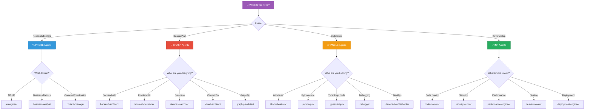
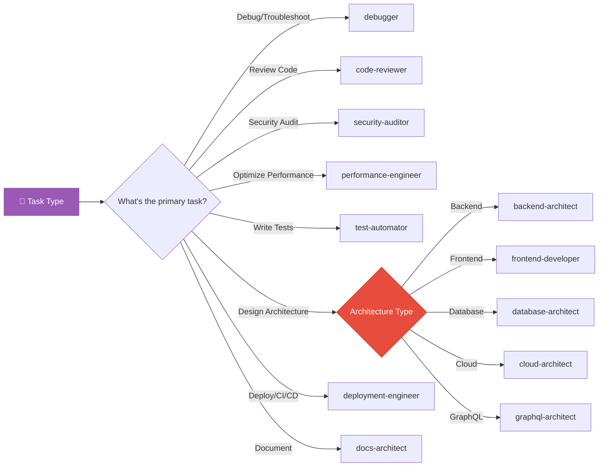
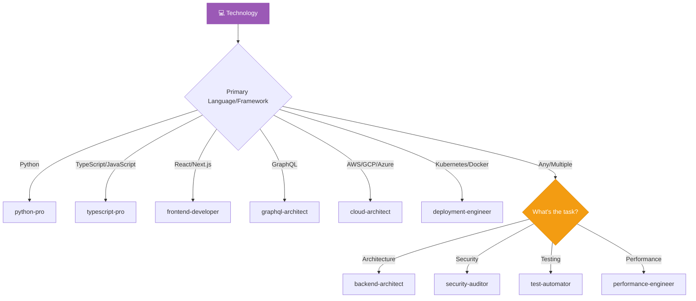

# Agent Decision Tree

> *When your brain says "which tentacle?!" - follow the flowchart.* 🐙

## Interactive Decision Trees

### By Development Phase



---

### By Task Type



---

### By Technology Stack



---

## Text-Based Quick Reference

### The 3-Question Method

**Question 1: What phase are you in?**

```
Research/Explore → PROBE tentacles
Design/Plan     → GRASP tentacles
Build/Code      → TANGLE tentacles
Review/Ship     → INK tentacles
```

**Question 2: What's your domain?**

```
Backend API     → backend-architect
Frontend UI     → frontend-developer
Database        → database-architect
Cloud/Infra     → cloud-architect
Security        → security-auditor
Testing         → tdd-orchestrator / test-automator
Performance     → performance-engineer
```

**Question 3: What's your language?**

```
Python          → python-pro
TypeScript/JS   → typescript-pro
Multiple/Any    → Use domain-specific tentacle
```

---

## Common Scenarios

### "I'm building a new feature"

```
Is it backend?
├─ Yes → Does it involve database schema?
│        ├─ Yes → database-architect FIRST, then backend-architect
│        └─ No  → backend-architect
└─ No → Is it frontend?
         ├─ Yes → frontend-developer
         └─ No  → What is it? (Describe and auto-route)
```

### "I need to fix something"

```
Is it a bug/error?
├─ Yes → debugger
│        └─ Still stuck? → devops-troubleshooter (if infra)
└─ No → Is it slow?
         ├─ Yes → performance-engineer
         │        └─ Database slow? → database-architect
         └─ No  → Is it insecure?
                  ├─ Yes → security-auditor
                  └─ No  → code-reviewer (quality issues)
```

### "I need a review"

```
What kind of review?
├─ General quality     → code-reviewer
├─ Security focused    → security-auditor
├─ Performance focused → performance-engineer
└─ Multiple concerns   → Use /octo:review skill
```

---

## The "Just Tell Me" Cheat Sheet

| If you're thinking... | Use this tentacle |
|-----------------------|-------------------|
| "I need to design an API" | `backend-architect` |
| "Something's broken" | `debugger` |
| "Is this secure?" | `security-auditor` |
| "Why is it slow?" | `performance-engineer` |
| "Review my code" | `code-reviewer` |
| "I want TDD" | `tdd-orchestrator` |
| "Design the database" | `database-architect` |
| "React/Next.js work" | `frontend-developer` |
| "Python code" | `python-pro` |
| "TypeScript types" | `typescript-pro` |
| "Cloud infrastructure" | `cloud-architect` |
| "GraphQL schema" | `graphql-architect` |
| "CI/CD pipeline" | `deployment-engineer` |
| "Production incident" | `incident-responder` |
| "Write documentation" | `docs-architect` |
| "Create a diagram" | `mermaid-expert` |

---

## When In Doubt

**Just describe what you need!** Claude Octopus auto-routes based on keywords:

```
"Build user authentication with OAuth"
→ Auto-routes to: backend-architect + database-architect

"Review this code for security issues"
→ Auto-routes to: security-auditor

"My API is slow"
→ Auto-routes to: performance-engineer
```

**Or use a workflow skill:**

| Skill | Does What |
|-------|-----------|
| `/octo:review` | Fast code review (define + develop) |
| `/octo:research` | Deep research (4-perspective discover) |
| `/octo:security` | Security audit (red team/blue team) |
| `/octo:embrace` | Full 4-phase Double Diamond workflow |

---

## Anti-Patterns: Don't Do This

| Bad Idea | Why | Do This Instead |
|----------|-----|-----------------|
| Use `security-auditor` for code style | Wrong domain | Use `code-reviewer` |
| Use `debugger` for architecture | Wrong phase | Use `backend-architect` |
| Use `database-architect` for API design | Wrong order | Design schema first, then API |
| Invoke principles agents directly | Internal use only | Use the persona that applies them |
| Use opus for simple tasks | Wastes tokens | Let auto-routing pick appropriate tier |

---

<p align="center">
  🐙 <em>"Eight tentacles, one goal: picking the right one for YOU."</em> 🐙
</p>
