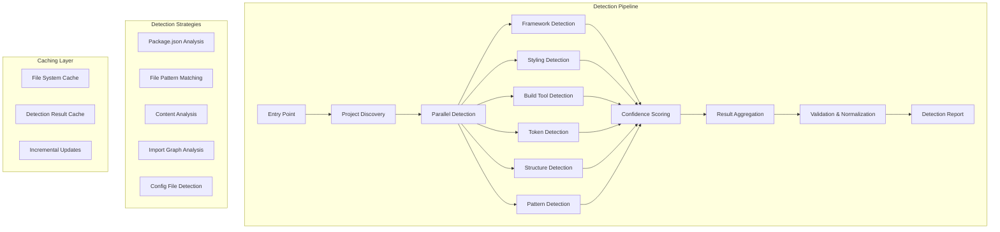

# Auto-Detection Engine Architecture

## Overview

The auto-detection engine is a sophisticated analysis system that identifies frontend project characteristics through static file analysis, dependency inspection, and pattern matching. It operates in multiple phases with confidence scoring and supports monorepos, microfrontends, and various project structures.

## System Architecture



## Detection Phases

### Phase 1: Project Discovery
Identify project boundaries, monorepo workspaces, and entry points.

### Phase 2: Dependency Analysis
Parse package.json files and analyze dependencies.

### Phase 3: Parallel Detection
Run all detectors concurrently for performance.

### Phase 4: Confidence Scoring
Calculate confidence scores based on multiple signals.

### Phase 5: Result Aggregation
Combine results and handle conflicts.

## Detection Algorithms

### 1. Framework Detection

#### Algorithm Pseudocode

```
function detectFramework(projectPath):
    signals = []

    // Phase 1: Package.json analysis (HIGH confidence)
    packageJson = readPackageJson(projectPath)
    if packageJson:
        signals.push(analyzeFrameworkDependencies(packageJson))

    // Phase 2: File pattern analysis (MEDIUM confidence)
    files = scanFiles(projectPath, FRAMEWORK_PATTERNS)
    signals.push(analyzeFrameworkFiles(files))

    // Phase 3: Content analysis (MEDIUM confidence)
    entryFiles = findEntryPoints(projectPath)
    for file in entryFiles:
        signals.push(analyzeFrameworkImports(file))
        signals.push(analyzeFrameworkSyntax(file))

    // Phase 4: Config file analysis (HIGH confidence)
    configs = findFrameworkConfigs(projectPath)
    signals.push(analyzeFrameworkConfigs(configs))

    // Phase 5: Calculate confidence scores
    scores = calculateFrameworkScores(signals)

    // Phase 6: Return top result with confidence
    return selectBestMatch(scores, threshold = 0.7)

function analyzeFrameworkDependencies(packageJson):
    scores = {
        react: 0,
        vue: 0,
        angular: 0,
        svelte: 0,
        vanilla: 0
    }

    deps = merge(packageJson.dependencies, packageJson.devDependencies)

    // React signals
    if 'react' in deps:
        scores.react += 50
    if 'react-dom' in deps:
        scores.react += 30
    if deps.react startsWith '^18' or '^19':
        scores.react += 10 // Recent version
    if 'next' in deps:
        scores.react += 20

    // Vue signals
    if 'vue' in deps:
        scores.vue += 50
    if deps.vue startsWith '^3':
        scores.vue += 20 // Vue 3
    if 'nuxt' in deps:
        scores.vue += 20
    if '@vue/compiler-sfc' in deps:
        scores.vue += 15

    // Angular signals
    if '@angular/core' in deps:
        scores.angular += 50
    if '@angular/cli' in deps:
        scores.angular += 20
    if 'zone.js' in deps:
        scores.angular += 15
    if 'rxjs' in deps:
        scores.angular += 10

    // Svelte signals
    if 'svelte' in deps:
        scores.svelte += 50
    if '@sveltejs/kit' in deps:
        scores.svelte += 20
    if '@sveltejs/vite-plugin-svelte' in deps:
        scores.svelte += 15

    // Vanilla signals (absence of frameworks)
    if sum(scores) == 0:
        scores.vanilla += 30

    return scores

function analyzeFrameworkFiles(files):
    scores = {
        react: 0,
        vue: 0,
        angular: 0,
        svelte: 0,
        vanilla: 0
    }

    // React signals
    if files.includes('**/*.jsx') or files.includes('**/*.tsx'):
        scores.react += 20
    if files.includes('**/App.jsx') or files.includes('**/App.tsx'):
        scores.react += 15

    // Vue signals
    if files.includes('**/*.vue'):
        scores.vue += 40
    if files.includes('**/App.vue'):
        scores.vue += 20

    // Angular signals
    if files.includes('**/angular.json'):
        scores.angular += 40
    if files.includes('**/*.component.ts'):
        scores.angular += 20
    if files.includes('**/*.module.ts'):
        scores.angular += 15

    // Svelte signals
    if files.includes('**/*.svelte'):
        scores.svelte += 40
    if files.includes('**/svelte.config.js'):
        scores.svelte += 20

    return scores

function analyzeFrameworkImports(fileContent):
    scores = {
        react: 0,
        vue: 0,
        angular: 0,
        svelte: 0
    }

    imports = extractImportStatements(fileContent)

    for imp in imports:
        if imp matches /from ['"]react['"]/:
            scores.react += 10
        if imp matches /from ['"]vue['"]/:
            scores.vue += 10
        if imp matches /from ['"]@angular\//:
            scores.angular += 10
        if imp matches /from ['"]svelte['"]/:
            scores.svelte += 10

    return scores

function analyzeFrameworkSyntax(fileContent):
    scores = {
        react: 0,
        vue: 0,
        angular: 0,
        svelte: 0
    }

    // React JSX patterns
    if fileContent matches /<[A-Z]\w+[^>]*>/: // Component tags
        scores.react += 15
    if fileContent matches /useState|useEffect|useCallback/:
        scores.react += 10

    // Vue template patterns
    if fileContent matches /v-if|v-for|v-bind|v-model/:
        scores.vue += 15
    if fileContent matches /<template>|<script setup>/:
        scores.vue += 20

    // Angular patterns
    if fileContent matches /\*ngIf|\*ngFor|ngModel/:
        scores.angular += 15
    if fileContent matches /@Component|@Injectable|@NgModule/:
        scores.angular += 20

    // Svelte patterns
    if fileContent matches /{#if|{#each|{#await/:
        scores.svelte += 15
    if fileContent matches /\$:|on:|bind:/:
        scores.svelte += 10

    return scores
```

#### File Scanning Patterns

```javascript
const FRAMEWORK_PATTERNS = {
  react: [
    '**/package.json',
    '**/*.jsx',
    '**/*.tsx',
    '**/App.jsx',
    '**/App.tsx',
    '**/next.config.js',
    '**/next.config.mjs',
    '**/.next/**',
  ],
  vue: [
    '**/package.json',
    '**/*.vue',
    '**/App.vue',
    '**/nuxt.config.js',
    '**/nuxt.config.ts',
    '**/vue.config.js',
    '**/.nuxt/**',
  ],
  angular: [
    '**/package.json',
    '**/angular.json',
    '**/*.component.ts',
    '**/*.module.ts',
    '**/*.service.ts',
    '**/app.component.ts',
  ],
  svelte: [
    '**/package.json',
    '**/*.svelte',
    '**/svelte.config.js',
    '**/App.svelte',
    '**/.svelte-kit/**',
  ],
  vanilla: [
    '**/package.json',
    '**/index.html',
    '**/*.js',
    '**/*.ts',
  ],
};
```

### 2. Styling Detection

#### Algorithm Pseudocode

```
function detectStyling(projectPath):
    signals = []

    // Phase 1: Package.json analysis
    packageJson = readPackageJson(projectPath)
    signals.push(analyzeStylingDependencies(packageJson))

    // Phase 2: Config file detection
    configs = findStylingConfigs(projectPath)
    signals.push(analyzeStylingConfigs(configs))

    // Phase 3: File pattern analysis
    files = scanFiles(projectPath, STYLING_PATTERNS)
    signals.push(analyzeStylingFiles(files))

    // Phase 4: Content analysis
    componentFiles = findComponentFiles(projectPath)
    signals.push(analyzeStylingUsage(componentFiles))

    // Calculate scores (can have multiple styling methods)
    scores = calculateStylingScores(signals)

    // Return all methods above threshold
    return selectAllAboveThreshold(scores, threshold = 0.5)

function analyzeStylingDependencies(packageJson):
    scores = {
        tailwind: 0,
        cssModules: 0,
        styledComponents: 0,
        emotion: 0,
        scss: 0,
        vanilla: 0
    }

    deps = merge(packageJson.dependencies, packageJson.devDependencies)

    // Tailwind
    if 'tailwindcss' in deps:
        scores.tailwind += 50
    if '@tailwindcss/forms' in deps or '@tailwindcss/typography' in deps:
        scores.tailwind += 15
    if 'autoprefixer' in deps and 'postcss' in deps:
        scores.tailwind += 10

    // Styled Components
    if 'styled-components' in deps:
        scores.styledComponents += 50
    if '@types/styled-components' in deps:
        scores.styledComponents += 10
    if 'babel-plugin-styled-components' in deps:
        scores.styledComponents += 15

    // Emotion
    if '@emotion/react' in deps or '@emotion/styled' in deps:
        scores.emotion += 50
    if '@emotion/css' in deps:
        scores.emotion += 15

    // SCSS/SASS
    if 'sass' in deps or 'node-sass' in deps:
        scores.scss += 50
    if 'sass-loader' in deps:
        scores.scss += 15

    // CSS Modules (harder to detect from deps)
    if 'typescript' in deps: // TS often uses CSS modules
        scores.cssModules += 10

    return scores

function analyzeStylingConfigs(configs):
    scores = {
        tailwind: 0,
        cssModules: 0,
        styledComponents: 0,
        emotion: 0,
        scss: 0
    }

    if configs.includes('tailwind.config.js') or configs.includes('tailwind.config.ts'):
        scores.tailwind += 40

    if configs.includes('postcss.config.js'):
        content = readFile('postcss.config.js')
        if content.includes('tailwindcss'):
            scores.tailwind += 20

    // Check for CSS module type declarations
    if configs.includes('**/*.module.css.d.ts'):
        scores.cssModules += 30

    return scores

function analyzeStylingFiles(files):
    scores = {
        tailwind: 0,
        cssModules: 0,
        styledComponents: 0,
        emotion: 0,
        scss: 0,
        vanilla: 0
    }

    // CSS Modules
    moduleCount = countMatches(files, '**/*.module.css')
    scores.cssModules += min(moduleCount * 5, 40)

    // SCSS
    scssCount = countMatches(files, '**/*.scss')
    scores.scss += min(scssCount * 5, 40)

    // Vanilla CSS
    cssCount = countMatches(files, '**/*.css')
    if cssCount > 0 and not files.includes('**/*.module.css'):
        scores.vanilla += min(cssCount * 3, 30)

    return scores

function analyzeStylingUsage(componentFiles):
    scores = {
        tailwind: 0,
        cssModules: 0,
        styledComponents: 0,
        emotion: 0
    }

    sampleFiles = selectRandomSample(componentFiles, maxSamples = 20)

    for file in sampleFiles:
        content = readFile(file)

        // Tailwind: className with utility classes
        if content matches /className=["'][^"']*\b(flex|grid|p-\d|m-\d|bg-|text-)/:
            scores.tailwind += 5

        // CSS Modules: styles.something
        if content matches /styles\.\w+/ or content matches /import.*from.*\.module\.css/:
            scores.cssModules += 5

        // Styled Components: styled.div or styled(Component)
        if content matches /styled\.\w+|styled\(/:
            scores.styledComponents += 5

        // Emotion: css`` or styled`` from emotion
        if content matches /@emotion/ or content matches /css`/:
            scores.emotion += 5

    return scores
```

#### File Scanning Patterns

```javascript
const STYLING_PATTERNS = {
  tailwind: [
    '**/tailwind.config.js',
    '**/tailwind.config.ts',
    '**/tailwind.config.cjs',
    '**/postcss.config.js',
  ],
  cssModules: [
    '**/*.module.css',
    '**/*.module.scss',
    '**/*.module.sass',
  ],
  styledComponents: [
    '**/package.json', // Check dependencies
  ],
  emotion: [
    '**/package.json', // Check dependencies
  ],
  scss: [
    '**/*.scss',
    '**/*.sass',
  ],
  vanilla: [
    '**/*.css',
    '**/styles/**/*.css',
  ],
};
```

### 3. Build Tool Detection

#### Algorithm Pseudocode

```
function detectBuildTool(projectPath):
    signals = []

    // Phase 1: Config file detection (HIGHEST confidence)
    configs = findBuildConfigs(projectPath)
    signals.push(analyzeBuildConfigs(configs))

    // Phase 2: Package.json scripts
    packageJson = readPackageJson(projectPath)
    signals.push(analyzeBuildScripts(packageJson))

    // Phase 3: Dependency analysis
    signals.push(analyzeBuildDependencies(packageJson))

    // Phase 4: Lock file analysis
    lockFiles = findLockFiles(projectPath)
    signals.push(analyzeLockFiles(lockFiles))

    // Phase 5: Output directory detection
    signals.push(analyzeBuildOutputs(projectPath))

    scores = calculateBuildToolScores(signals)
    return selectBestMatch(scores, threshold = 0.6)

function analyzeBuildConfigs(configs):
    scores = {
        vite: 0,
        webpack: 0,
        parcel: 0,
        esbuild: 0,
        rollup: 0,
        turbopack: 0
    }

    // High confidence signals
    if configs.includes('vite.config.js') or configs.includes('vite.config.ts'):
        scores.vite += 60

    if configs.includes('webpack.config.js') or configs.includes('webpack.config.ts'):
        scores.webpack += 60

    if configs.includes('.parcelrc'):
        scores.parcel += 60

    if configs.includes('esbuild.config.js'):
        scores.esbuild += 60

    if configs.includes('rollup.config.js') or configs.includes('rollup.config.ts'):
        scores.rollup += 60

    if configs.includes('turbo.json'):
        scores.turbopack += 40

    return scores

function analyzeBuildScripts(packageJson):
    scores = {
        vite: 0,
        webpack: 0,
        parcel: 0,
        esbuild: 0
    }

    scripts = packageJson.scripts or {}

    for scriptName, scriptCommand in scripts:
        if scriptCommand includes 'vite':
            scores.vite += 20
        if scriptCommand includes 'webpack':
            scores.webpack += 20
        if scriptCommand includes 'parcel':
            scores.parcel += 20
        if scriptCommand includes 'esbuild':
            scores.esbuild += 20

    return scores

function analyzeBuildDependencies(packageJson):
    scores = {
        vite: 0,
        webpack: 0,
        parcel: 0,
        esbuild: 0,
        rollup: 0
    }

    deps = merge(packageJson.dependencies, packageJson.devDependencies)

    if 'vite' in deps:
        scores.vite += 30
    if '@vitejs/plugin-react' in deps or '@vitejs/plugin-vue' in deps:
        scores.vite += 15

    if 'webpack' in deps:
        scores.webpack += 30
    if 'webpack-dev-server' in deps or 'webpack-cli' in deps:
        scores.webpack += 15

    if 'parcel' in deps or 'parcel-bundler' in deps:
        scores.parcel += 30

    if 'esbuild' in deps:
        scores.esbuild += 30

    if 'rollup' in deps:
        scores.rollup += 30

    return scores

function analyzeBuildOutputs(projectPath):
    scores = {
        vite: 0,
        webpack: 0,
        parcel: 0
    }

    if directoryExists(projectPath + '/dist'):
        scores.vite += 10
        scores.rollup += 10

    if directoryExists(projectPath + '/build'):
        scores.webpack += 10

    if directoryExists(projectPath + '/.parcel-cache'):
        scores.parcel += 20

    return scores
```

#### File Scanning Patterns

```javascript
const BUILD_TOOL_PATTERNS = {
  vite: [
    '**/vite.config.js',
    '**/vite.config.ts',
    '**/vite.config.mjs',
  ],
  webpack: [
    '**/webpack.config.js',
    '**/webpack.config.ts',
    '**/webpack.*.js',
  ],
  parcel: [
    '**/.parcelrc',
    '**/parcel.config.js',
  ],
  esbuild: [
    '**/esbuild.config.js',
    '**/esbuild.config.mjs',
  ],
  rollup: [
    '**/rollup.config.js',
    '**/rollup.config.ts',
    '**/rollup.config.mjs',
  ],
  turbopack: [
    '**/turbo.json',
  ],
};
```

### 4. Token File Detection

#### Algorithm Pseudocode

```
function detectTokenFiles(projectPath):
    signals = []

    // Phase 1: Common token file patterns
    tokenFiles = scanFiles(projectPath, TOKEN_FILE_PATTERNS)
    signals.push(analyzeTokenFiles(tokenFiles))

    // Phase 2: Design system directories
    designDirs = findDesignSystemDirs(projectPath)
    signals.push(analyzeDesignDirs(designDirs))

    // Phase 3: CSS variable extraction
    cssFiles = findCSSFiles(projectPath)
    signals.push(extractCSSVariables(cssFiles))

    // Phase 4: Theme config detection
    configs = findThemeConfigs(projectPath)
    signals.push(analyzeThemeConfigs(configs))

    return aggregateTokenSources(signals)

function analyzeTokenFiles(files):
    tokenSources = []

    for file in files:
        content = readFile(file)

        // Detect file type and extract tokens
        if file matches /\.ts$|\.js$/:
            tokens = extractJSTokens(content)
            if tokens.colors or tokens.spacing or tokens.typography:
                tokenSources.push({
                    file: file,
                    type: 'javascript',
                    tokens: tokens,
                    confidence: 0.9
                })

        if file matches /tailwind\.config\.(js|ts)/:
            tokens = extractTailwindTokens(content)
            tokenSources.push({
                file: file,
                type: 'tailwind',
                tokens: tokens,
                confidence: 1.0
            })

        if file matches /\.css$|\.scss$/:
            tokens = extractCSSTokens(content)
            if tokens.length > 5: // Minimum threshold
                tokenSources.push({
                    file: file,
                    type: 'css',
                    tokens: tokens,
                    confidence: 0.8
                })

    return tokenSources

function extractJSTokens(content):
    tokens = {
        colors: {},
        spacing: {},
        typography: {},
        breakpoints: {},
        shadows: {},
        borderRadius: {}
    }

    // Look for common token patterns
    // Example: export const colors = { primary: '#...', ... }
    if content matches /export.*colors.*=.*{/:
        tokens.colors = extractObjectLiteral(content, 'colors')

    if content matches /export.*spacing.*=.*{/:
        tokens.spacing = extractObjectLiteral(content, 'spacing')

    if content matches /export.*typography.*=.*{/:
        tokens.typography = extractObjectLiteral(content, 'typography')

    // Look for theme objects
    if content matches /theme.*=.*{/:
        theme = extractObjectLiteral(content, 'theme')
        tokens = merge(tokens, theme)

    return tokens

function extractTailwindTokens(content):
    tokens = {}

    // Parse tailwind config
    config = parseJavaScript(content)

    if config.theme:
        tokens.colors = config.theme.colors or config.theme.extend?.colors
        tokens.spacing = config.theme.spacing or config.theme.extend?.spacing
        tokens.fontSize = config.theme.fontSize or config.theme.extend?.fontSize
        tokens.fontFamily = config.theme.fontFamily or config.theme.extend?.fontFamily
        tokens.screens = config.theme.screens
        tokens.borderRadius = config.theme.borderRadius or config.theme.extend?.borderRadius
        tokens.boxShadow = config.theme.boxShadow or config.theme.extend?.boxShadow

    return tokens

function extractCSSVariables(cssFiles):
    variables = []

    for file in cssFiles:
        content = readFile(file)

        // Find :root or other CSS variable declarations
        matches = content.matchAll(/--[\w-]+:\s*([^;]+);/g)

        for match in matches:
            varName = match[0]
            varValue = match[1]

            category = categorizeVariable(varName)

            variables.push({
                name: varName,
                value: varValue,
                category: category,
                file: file
            })

    return variables

function categorizeVariable(varName):
    // Categorize based on naming conventions
    if varName matches /color|bg|text|border-color/:
        return 'color'
    if varName matches /space|spacing|margin|padding|gap/:
        return 'spacing'
    if varName matches /font|text/:
        return 'typography'
    if varName matches /shadow/:
        return 'shadow'
    if varName matches /radius|rounded/:
        return 'borderRadius'
    if varName matches /breakpoint|screen/:
        return 'breakpoint'

    return 'other'
```

#### File Scanning Patterns

```javascript
const TOKEN_FILE_PATTERNS = {
  common: [
    '**/theme.ts',
    '**/theme.js',
    '**/tokens.ts',
    '**/tokens.js',
    '**/design-tokens.ts',
    '**/design-tokens.js',
    '**/tailwind.config.js',
    '**/tailwind.config.ts',
    '**/:root.css',
    '**/variables.css',
    '**/vars.css',
    '**/theme.css',
  ],
  designSystem: [
    '**/design-system/**/tokens/**',
    '**/design-system/**/theme/**',
    '**/ds/**/tokens/**',
    '**/ui/**/tokens/**',
  ],
  styleDict: [
    '**/tokens.json',
    '**/design-tokens.json',
    '**/tokens/**/*.json',
  ],
};
```

### 5. Component Directory Detection

#### Algorithm Pseudocode

```
function detectComponentDirs(projectPath, framework):
    signals = []

    // Phase 1: Common directory patterns
    dirs = scanDirectories(projectPath, COMPONENT_DIR_PATTERNS)
    signals.push(analyzeDirectoryStructure(dirs))

    // Phase 2: File density analysis
    signals.push(analyzeComponentFileDensity(projectPath))

    // Phase 3: Framework-specific patterns
    signals.push(analyzeFrameworkPatterns(projectPath, framework))

    // Phase 4: Import graph analysis
    signals.push(analyzeImportPatterns(projectPath))

    return aggregateComponentDirs(signals)

function analyzeDirectoryStructure(dirs):
    candidates = []

    for dir in dirs:
        score = 0

        // Check directory name
        if dir matches /components?/i:
            score += 40
        if dir matches /ui/i:
            score += 30
        if dir matches /widgets?/i:
            score += 25
        if dir matches /elements?/i:
            score += 25

        // Check for index files
        if fileExists(dir + '/index.ts') or fileExists(dir + '/index.js'):
            score += 15

        // Check subdirectory structure
        subdirs = listDirectories(dir)
        if subdirs.length > 3: // Multiple components
            score += 20

        candidates.push({
            path: dir,
            score: score,
            type: inferComponentType(dir)
        })

    return candidates

function analyzeComponentFileDensity(projectPath):
    directories = {}

    // Find all component files
    componentFiles = findComponentFiles(projectPath)

    for file in componentFiles:
        dir = getParentDirectory(file)

        if dir not in directories:
            directories[dir] = {
                count: 0,
                files: []
            }

        directories[dir].count += 1
        directories[dir].files.push(file)

    // Score directories by density
    candidates = []
    for dir, data in directories:
        if data.count >= 3: // Minimum 3 components
            candidates.push({
                path: dir,
                score: min(data.count * 5, 50),
                componentCount: data.count
            })

    return candidates

function analyzeFrameworkPatterns(projectPath, framework):
    patterns = FRAMEWORK_COMPONENT_PATTERNS[framework]

    if not patterns:
        return []

    candidates = []

    for pattern in patterns:
        matches = glob(projectPath, pattern)

        for match in matches:
            dir = getParentDirectory(match)
            candidates.push({
                path: dir,
                score: 30,
                frameworkSpecific: true
            })

    return candidates

function inferComponentType(dirPath):
    name = basename(dirPath).toLowerCase()

    if name includes 'common' or name includes 'shared':
        return 'shared'
    if name includes 'layout':
        return 'layout'
    if name includes 'page' or name includes 'view':
        return 'page'
    if name includes 'form':
        return 'form'
    if name includes 'ui':
        return 'ui'

    return 'general'
```

#### Directory Scanning Patterns

```javascript
const COMPONENT_DIR_PATTERNS = [
  '**/components',
  '**/component',
  '**/Components',
  '**/ui',
  '**/UI',
  '**/elements',
  '**/widgets',
  '**/shared',
  '**/common',
];

const FRAMEWORK_COMPONENT_PATTERNS = {
  react: [
    '**/*.jsx',
    '**/*.tsx',
  ],
  vue: [
    '**/*.vue',
  ],
  angular: [
    '**/*.component.ts',
  ],
  svelte: [
    '**/*.svelte',
  ],
};
```

### 6. Routing Pattern Detection

#### Algorithm Pseudocode

```
function detectRoutingPatterns(projectPath, framework):
    signals = []

    // Phase 1: Framework-specific routing
    signals.push(detectFrameworkRouting(projectPath, framework))

    // Phase 2: File-based routing
    signals.push(detectFileBasedRouting(projectPath))

    // Phase 3: Router library detection
    packageJson = readPackageJson(projectPath)
    signals.push(detectRouterLibraries(packageJson))

    // Phase 4: Route configuration files
    signals.push(detectRouteConfigs(projectPath))

    return aggregateRoutingPatterns(signals)

function detectFileBasedRouting(projectPath):
    patterns = []

    // Next.js App Router
    if directoryExists(projectPath + '/app'):
        appFiles = glob(projectPath + '/app', '**/page.tsx')
        if appFiles.length > 0:
            patterns.push({
                type: 'file-based',
                framework: 'next-app',
                pattern: 'app-router',
                confidence: 0.95,
                routeFiles: appFiles
            })

    // Next.js Pages Router
    if directoryExists(projectPath + '/pages'):
        pageFiles = glob(projectPath + '/pages', '**/*.tsx')
        if pageFiles.length > 0:
            patterns.push({
                type: 'file-based',
                framework: 'next-pages',
                pattern: 'pages-router',
                confidence: 0.95,
                routeFiles: pageFiles
            })

    // Nuxt.js
    if directoryExists(projectPath + '/pages'):
        vuePages = glob(projectPath + '/pages', '**/*.vue')
        if vuePages.length > 0:
            patterns.push({
                type: 'file-based',
                framework: 'nuxt',
                pattern: 'nuxt-pages',
                confidence: 0.95,
                routeFiles: vuePages
            })

    // SvelteKit
    if directoryExists(projectPath + '/src/routes'):
        svelteRoutes = glob(projectPath + '/src/routes', '**/+page.svelte')
        if svelteRoutes.length > 0:
            patterns.push({
                type: 'file-based',
                framework: 'sveltekit',
                pattern: 'sveltekit-routes',
                confidence: 0.95,
                routeFiles: svelteRoutes
            })

    return patterns

function detectRouterLibraries(packageJson):
    routers = []

    deps = merge(packageJson.dependencies, packageJson.devDependencies)

    if 'react-router-dom' in deps:
        routers.push({
            type: 'library',
            name: 'react-router',
            version: deps['react-router-dom'],
            confidence: 0.9
        })

    if 'vue-router' in deps:
        routers.push({
            type: 'library',
            name: 'vue-router',
            version: deps['vue-router'],
            confidence: 0.9
        })

    if '@angular/router' in deps:
        routers.push({
            type: 'library',
            name: 'angular-router',
            version: deps['@angular/router'],
            confidence: 0.9
        })

    if '@reach/router' in deps:
        routers.push({
            type: 'library',
            name: 'reach-router',
            version: deps['@reach/router'],
            confidence: 0.9
        })

    if 'wouter' in deps:
        routers.push({
            type: 'library',
            name: 'wouter',
            version: deps['wouter'],
            confidence: 0.9
        })

    return routers

function detectRouteConfigs(projectPath):
    configs = []

    // Look for route configuration files
    routeFiles = glob(projectPath, '**/routes.{ts,js}')
    routeFiles += glob(projectPath, '**/router.{ts,js}')
    routeFiles += glob(projectPath, '**/app-routing.module.ts')

    for file in routeFiles:
        content = readFile(file)

        // Analyze route definitions
        routes = extractRouteDefinitions(content)

        if routes.length > 0:
            configs.push({
                file: file,
                routes: routes,
                confidence: 0.85
            })

    return configs

function extractRouteDefinitions(content):
    routes = []

    // Match common route definition patterns
    // React Router: { path: '/...', element: ... }
    matches = content.matchAll(/path:\s*['"]([^'"]+)['"]/g)
    for match in matches:
        routes.push({
            path: match[1],
            type: 'react-router'
        })

    // Vue Router: { path: '/...', component: ... }
    matches = content.matchAll(/path:\s*['"]([^'"]+)['"],\s*component:/g)
    for match in matches:
        routes.push({
            path: match[1],
            type: 'vue-router'
        })

    // Angular: { path: '...', component: ... }
    matches = content.matchAll(/{\s*path:\s*['"]([^'"]+)['"]/g)
    for match in matches:
        routes.push({
            path: match[1],
            type: 'angular-router'
        })

    return routes
```

### 7. State Management Detection

#### Algorithm Pseudocode

```
function detectStateManagement(projectPath, framework):
    signals = []

    // Phase 1: Package analysis
    packageJson = readPackageJson(projectPath)
    signals.push(detectStateLibraries(packageJson))

    // Phase 2: Store directory detection
    signals.push(detectStoreDirectories(projectPath))

    // Phase 3: Context/Provider detection
    signals.push(detectContextProviders(projectPath, framework))

    // Phase 4: Store file analysis
    signals.push(analyzeStoreFiles(projectPath))

    return aggregateStateManagement(signals)

function detectStateLibraries(packageJson):
    libraries = []

    deps = merge(packageJson.dependencies, packageJson.devDependencies)

    // Redux ecosystem
    if 'redux' in deps:
        libraries.push({
            name: 'redux',
            type: 'global',
            confidence: 0.9
        })
    if '@reduxjs/toolkit' in deps:
        libraries.push({
            name: 'redux-toolkit',
            type: 'global',
            confidence: 0.95
        })

    // Zustand
    if 'zustand' in deps:
        libraries.push({
            name: 'zustand',
            type: 'global',
            confidence: 0.9
        })

    // Jotai
    if 'jotai' in deps:
        libraries.push({
            name: 'jotai',
            type: 'atomic',
            confidence: 0.9
        })

    // Recoil
    if 'recoil' in deps:
        libraries.push({
            name: 'recoil',
            type: 'atomic',
            confidence: 0.9
        })

    // MobX
    if 'mobx' in deps:
        libraries.push({
            name: 'mobx',
            type: 'global',
            confidence: 0.9
        })

    // Vuex
    if 'vuex' in deps:
        libraries.push({
            name: 'vuex',
            type: 'global',
            confidence: 0.9
        })

    // Pinia
    if 'pinia' in deps:
        libraries.push({
            name: 'pinia',
            type: 'global',
            confidence: 0.9
        })

    // XState
    if 'xstate' in deps:
        libraries.push({
            name: 'xstate',
            type: 'state-machine',
            confidence: 0.9
        })

    // NgRx (Angular)
    if '@ngrx/store' in deps:
        libraries.push({
            name: 'ngrx',
            type: 'global',
            confidence: 0.9
        })

    // Svelte stores are built-in, check for usage
    if framework == 'svelte':
        libraries.push({
            name: 'svelte-stores',
            type: 'builtin',
            confidence: 0.7 // Will confirm with file analysis
        })

    return libraries

function detectStoreDirectories(projectPath):
    stores = []

    // Common store directory patterns
    patterns = [
        '**/store',
        '**/stores',
        '**/state',
        '**/redux',
        '**/zustand',
    ]

    for pattern in patterns:
        matches = glob(projectPath, pattern)

        for dir in matches:
            files = listFiles(dir)

            if files.length > 0:
                stores.push({
                    directory: dir,
                    fileCount: files.length,
                    confidence: 0.8
                })

    return stores

function detectContextProviders(projectPath, framework):
    providers = []

    if framework == 'react':
        // Find Context usage
        files = glob(projectPath, '**/*.{tsx,jsx}')

        for file in files:
            content = readFile(file)

            // Look for createContext
            if content matches /createContext/:
                providers.push({
                    file: file,
                    type: 'react-context',
                    confidence: 0.8
                })

    return providers

function analyzeStoreFiles(projectPath):
    stores = []

    // Find potential store files
    files = glob(projectPath, '**/{store,stores,state}/**/*.{ts,js}')
    files += glob(projectPath, '**/*Store.{ts,js}')
    files += glob(projectPath, '**/*store.{ts,js}')

    for file in files:
        content = readFile(file)

        storeType = identifyStoreType(content)

        if storeType:
            stores.push({
                file: file,
                type: storeType,
                confidence: 0.85
            })

    return stores

function identifyStoreType(content):
    // Redux
    if content matches /createSlice|configureStore/:
        return 'redux-toolkit'
    if content matches /createStore|combineReducers/:
        return 'redux'

    // Zustand
    if content matches /create.*=.*set.*get/:
        return 'zustand'

    // Jotai
    if content matches /atom\(/:
        return 'jotai'

    // Recoil
    if content matches /atom\({.*key:/:
        return 'recoil'

    // MobX
    if content matches /makeObservable|makeAutoObservable/:
        return 'mobx'

    // Pinia
    if content matches /defineStore/:
        return 'pinia'

    // Vuex
    if content matches /createStore.*{.*state:/:
        return 'vuex'

    // XState
    if content matches /createMachine/:
        return 'xstate'

    // NgRx
    if content matches /createAction|createReducer|createFeature/:
        return 'ngrx'

    return null
```

### 8. Design System Signals Detection

#### Algorithm Pseudocode

```
function detectDesignSystemSignals(projectPath):
    signals = {
        hasDesignSystem: false,
        confidence: 0,
        indicators: []
    }

    // Phase 1: Package naming
    packageJson = readPackageJson(projectPath)
    if packageJson.name matches /design-system|ui-kit|component-library/:
        signals.indicators.push({
            type: 'package-name',
            score: 40
        })

    // Phase 2: Directory structure
    if directoryExists(projectPath + '/design-system'):
        signals.indicators.push({
            type: 'design-system-dir',
            score: 50
        })

    // Phase 3: Storybook presence
    if 'storybook' in packageJson.devDependencies:
        signals.indicators.push({
            type: 'storybook',
            score: 30
        })

    // Phase 4: Documentation files
    docFiles = glob(projectPath, '**/{DESIGN,COMPONENTS,STYLEGUIDE}.md')
    if docFiles.length > 0:
        signals.indicators.push({
            type: 'documentation',
            score: 20
        })

    // Phase 5: Token files
    tokenFiles = detectTokenFiles(projectPath)
    if tokenFiles.length > 0:
        signals.indicators.push({
            type: 'design-tokens',
            score: 35
        })

    // Phase 6: Component density
    componentCount = countComponentFiles(projectPath)
    if componentCount > 20:
        signals.indicators.push({
            type: 'high-component-count',
            score: 25
        })

    // Calculate total confidence
    totalScore = sum(indicator.score for indicator in signals.indicators)
    signals.confidence = min(totalScore / 100, 1.0)
    signals.hasDesignSystem = signals.confidence > 0.5

    return signals
```

### 9. Architecture Signals Detection

#### Algorithm Pseudocode

```
function detectArchitectureSignals(projectPath):
    architecture = {
        patterns: [],
        layers: [],
        confidence: {}
    }

    // Phase 1: Directory structure analysis
    dirs = listAllDirectories(projectPath)
    architecture.patterns = analyzeArchitecturePatterns(dirs)

    // Phase 2: Layered architecture detection
    architecture.layers = detectArchitectureLayers(projectPath)

    // Phase 3: API client detection
    architecture.apiClients = detectAPIClients(projectPath)

    // Phase 4: Service layer detection
    architecture.services = detectServiceLayer(projectPath)

    // Phase 5: Data layer detection
    architecture.dataLayer = detectDataLayer(projectPath)

    return architecture

function analyzeArchitecturePatterns(dirs):
    patterns = []

    // Feature-based architecture
    if dirs.includes('features') or dirs.includes('modules'):
        featureCount = countSubdirectories('features') + countSubdirectories('modules')
        if featureCount > 2:
            patterns.push({
                type: 'feature-based',
                confidence: 0.8,
                details: {
                    featureCount: featureCount
                }
            })

    // Layered architecture
    hasPresentation = dirs.includes('components') or dirs.includes('views')
    hasLogic = dirs.includes('services') or dirs.includes('business')
    hasData = dirs.includes('repositories') or dirs.includes('data')

    if hasPresentation and hasLogic and hasData:
        patterns.push({
            type: 'layered',
            confidence: 0.9
        })

    // Domain-driven design
    if dirs.includes('domain') or dirs.includes('entities'):
        patterns.push({
            type: 'domain-driven',
            confidence: 0.7
        })

    // Clean architecture
    if dirs.includes('domain') and dirs.includes('infrastructure') and dirs.includes('application'):
        patterns.push({
            type: 'clean-architecture',
            confidence: 0.85
        })

    return patterns

function detectArchitectureLayers(projectPath):
    layers = []

    // Presentation layer
    if directoryExists(projectPath + '/components') or directoryExists(projectPath + '/views'):
        layers.push({
            name: 'presentation',
            directories: ['components', 'views', 'pages'],
            confidence: 0.9
        })

    // Application/Business logic layer
    if directoryExists(projectPath + '/services') or directoryExists(projectPath + '/hooks'):
        layers.push({
            name: 'application',
            directories: ['services', 'hooks', 'composables', 'business'],
            confidence: 0.85
        })

    // Data layer
    if directoryExists(projectPath + '/api') or directoryExists(projectPath + '/repositories'):
        layers.push({
            name: 'data',
            directories: ['api', 'repositories', 'data', 'models'],
            confidence: 0.85
        })

    // Infrastructure layer
    if directoryExists(projectPath + '/lib') or directoryExists(projectPath + '/utils'):
        layers.push({
            name: 'infrastructure',
            directories: ['lib', 'utils', 'helpers', 'infrastructure'],
            confidence: 0.8
        })

    return layers

function detectAPIClients(projectPath):
    clients = []

    // Look for API client files
    apiFiles = glob(projectPath, '**/api/**/*.{ts,js}')
    apiFiles += glob(projectPath, '**/*api.{ts,js}')
    apiFiles += glob(projectPath, '**/*client.{ts,js}')

    for file in apiFiles:
        content = readFile(file)

        // Detect HTTP client library
        if content matches /axios/:
            clients.push({
                file: file,
                library: 'axios',
                confidence: 0.9
            })

        if content matches /fetch\(/:
            clients.push({
                file: file,
                library: 'fetch',
                confidence: 0.8
            })

        if content matches /ky|got|superagent/:
            clients.push({
                file: file,
                library: 'other',
                confidence: 0.7
            })

    return clients

function detectServiceLayer(projectPath):
    services = []

    // Service directory
    if directoryExists(projectPath + '/services'):
        files = glob(projectPath + '/services', '**/*.{ts,js}')

        services.push({
            directory: projectPath + '/services',
            fileCount: files.length,
            confidence: 0.9
        })

    // Service files scattered
    serviceFiles = glob(projectPath, '**/*Service.{ts,js}')
    serviceFiles += glob(projectPath, '**/*service.{ts,js}')

    if serviceFiles.length > 3:
        services.push({
            pattern: 'scattered',
            files: serviceFiles,
            confidence: 0.7
        })

    return services

function detectDataLayer(projectPath):
    dataLayer = {
        hasLayer: false,
        patterns: []
    }

    // Repository pattern
    if directoryExists(projectPath + '/repositories'):
        dataLayer.patterns.push({
            type: 'repository',
            directory: projectPath + '/repositories',
            confidence: 0.9
        })
        dataLayer.hasLayer = true

    // Models/Entities
    if directoryExists(projectPath + '/models') or directoryExists(projectPath + '/entities'):
        dataLayer.patterns.push({
            type: 'models',
            directories: ['models', 'entities'],
            confidence: 0.85
        })
        dataLayer.hasLayer = true

    // ORMs/Query builders
    packageJson = readPackageJson(projectPath)
    deps = merge(packageJson.dependencies, packageJson.devDependencies)

    if 'prisma' in deps:
        dataLayer.patterns.push({
            type: 'orm',
            name: 'prisma',
            confidence: 0.95
        })

    if 'typeorm' in deps:
        dataLayer.patterns.push({
            type: 'orm',
            name: 'typeorm',
            confidence: 0.95
        })

    if 'drizzle-orm' in deps:
        dataLayer.patterns.push({
            type: 'orm',
            name: 'drizzle',
            confidence: 0.95
        })

    return dataLayer
```

## Confidence Scoring System

### Scoring Algorithm

```
function calculateConfidenceScore(signals):
    // Weight different signal types
    weights = {
        packageJson: 1.0,      // Highest confidence
        configFile: 0.95,      // Very high confidence
        filePattern: 0.7,      // Medium-high confidence
        contentAnalysis: 0.6,  // Medium confidence
        naming: 0.5            // Lower confidence
    }

    totalScore = 0
    maxPossibleScore = 0

    for signal in signals:
        weight = weights[signal.type]
        totalScore += signal.score * weight
        maxPossibleScore += 100 * weight

    confidence = totalScore / maxPossibleScore

    return confidence

function selectBestMatch(scores, threshold):
    sortedScores = sort(scores, descending = true)

    if sortedScores[0].confidence < threshold:
        return {
            detected: false,
            reason: 'confidence_too_low',
            bestGuess: sortedScores[0]
        }

    return {
        detected: true,
        result: sortedScores[0].name,
        confidence: sortedScores[0].confidence,
        alternatives: sortedScores[1:3] // Top 3 alternatives
    }

function selectAllAboveThreshold(scores, threshold):
    matches = []

    for score in scores:
        if score.confidence >= threshold:
            matches.push({
                name: score.name,
                confidence: score.confidence
            })

    return matches
```

### Confidence Thresholds

```javascript
const CONFIDENCE_THRESHOLDS = {
  framework: 0.7,      // High confidence required
  buildTool: 0.6,      // Medium-high confidence
  styling: 0.5,        // Medium confidence (can have multiple)
  routing: 0.6,        // Medium-high confidence
  stateManagement: 0.6, // Medium-high confidence
  tokens: 0.5,         // Medium confidence
  components: 0.4,     // Lower threshold (exploratory)
  architecture: 0.5,   // Medium confidence
};
```

## Performance Optimization

### 1. File System Caching

```typescript
class FileSystemCache {
  private cache: Map<string, CacheEntry> = new Map();
  private ttl: number = 60000; // 1 minute

  async readFile(path: string): Promise<string> {
    const cached = this.cache.get(path);

    if (cached && Date.now() - cached.timestamp < this.ttl) {
      return cached.content;
    }

    const content = await fs.readFile(path, 'utf-8');
    this.cache.set(path, {
      content,
      timestamp: Date.now()
    });

    return content;
  }

  invalidate(path: string): void {
    this.cache.delete(path);
  }

  clear(): void {
    this.cache.clear();
  }
}
```

### 2. Parallel Processing

```typescript
async function runDetectionPipeline(projectPath: string): Promise<DetectionResult> {
  // Run all detectors in parallel
  const [
    framework,
    styling,
    buildTool,
    tokens,
    components,
    routing,
    stateManagement,
    designSystem,
    architecture
  ] = await Promise.all([
    detectFramework(projectPath),
    detectStyling(projectPath),
    detectBuildTool(projectPath),
    detectTokenFiles(projectPath),
    detectComponentDirs(projectPath),
    detectRoutingPatterns(projectPath),
    detectStateManagement(projectPath),
    detectDesignSystemSignals(projectPath),
    detectArchitectureSignals(projectPath)
  ]);

  return aggregateResults({
    framework,
    styling,
    buildTool,
    tokens,
    components,
    routing,
    stateManagement,
    designSystem,
    architecture
  });
}
```

### 3. Incremental Detection

```typescript
class IncrementalDetector {
  private previousResults: DetectionResult | null = null;
  private watchedFiles: Set<string> = new Set();

  async detect(projectPath: string, changedFiles?: string[]): Promise<DetectionResult> {
    if (!this.previousResults || !changedFiles) {
      // Full detection on first run
      return this.fullDetection(projectPath);
    }

    // Determine which detectors need to re-run
    const detectorsToRerun = this.determineAffectedDetectors(changedFiles);

    // Only re-run affected detectors
    const updates = await this.partialDetection(projectPath, detectorsToRerun);

    // Merge with previous results
    return this.mergeResults(this.previousResults, updates);
  }

  private determineAffectedDetectors(changedFiles: string[]): Set<string> {
    const affected = new Set<string>();

    for (const file of changedFiles) {
      if (file.includes('package.json')) {
        affected.add('framework');
        affected.add('buildTool');
        affected.add('styling');
        affected.add('stateManagement');
      }

      if (file.includes('tailwind.config')) {
        affected.add('styling');
        affected.add('tokens');
      }

      if (file.match(/\.(jsx|tsx|vue|svelte)$/)) {
        affected.add('components');
      }

      // Add more rules...
    }

    return affected;
  }
}
```

### 4. Lazy Content Analysis

```typescript
async function analyzeFrameworkSyntax(filePath: string): Promise<FrameworkSignals> {
  // Only read file content if needed
  const ext = path.extname(filePath);

  // Skip if extension gives us enough info
  if (ext === '.vue') {
    return { vue: 40, react: 0, angular: 0, svelte: 0 };
  }

  if (ext === '.svelte') {
    return { svelte: 40, vue: 0, react: 0, angular: 0 };
  }

  // Read content only for ambiguous files
  if (ext === '.tsx' || ext === '.jsx' || ext === '.ts' || ext === '.js') {
    const content = await readFile(filePath);
    return analyzeContentForFramework(content);
  }

  return { react: 0, vue: 0, angular: 0, svelte: 0 };
}
```

### 5. Glob Pattern Optimization

```typescript
// Optimize glob patterns to minimize file system operations
const OPTIMIZED_PATTERNS = {
  // Bad: Scans entire project
  bad: '**/*.tsx',

  // Good: Focuses on likely locations
  good: [
    'src/**/*.tsx',
    'app/**/*.tsx',
    'components/**/*.tsx'
  ],

  // Better: Excludes common non-source directories
  better: [
    'src/**/*.tsx',
    'app/**/*.tsx',
    'components/**/*.tsx',
    '!**/node_modules/**',
    '!**/dist/**',
    '!**/build/**',
    '!**/.next/**'
  ]
};

// Use negation patterns to exclude large directories
function optimizedGlob(pattern: string): string[] {
  const excludePatterns = [
    '!**/node_modules/**',
    '!**/dist/**',
    '!**/build/**',
    '!**/.next/**',
    '!**/.nuxt/**',
    '!**/out/**',
    '!**/coverage/**'
  ];

  return glob([pattern, ...excludePatterns]);
}
```

### 6. Sampling for Large Projects

```typescript
function sampleComponentFiles(files: string[], maxSamples: number = 20): string[] {
  if (files.length <= maxSamples) {
    return files;
  }

  // Stratified sampling: ensure we sample from different directories
  const byDirectory = groupBy(files, f => path.dirname(f));
  const samplesPerDir = Math.ceil(maxSamples / Object.keys(byDirectory).length);

  const samples: string[] = [];

  for (const [dir, dirFiles] of Object.entries(byDirectory)) {
    const dirSamples = dirFiles.slice(0, samplesPerDir);
    samples.push(...dirSamples);

    if (samples.length >= maxSamples) {
      break;
    }
  }

  return samples.slice(0, maxSamples);
}
```

## Error Handling

### Edge Cases and Error Strategies

```typescript
class DetectionError extends Error {
  constructor(
    message: string,
    public code: string,
    public recoverable: boolean = true
  ) {
    super(message);
  }
}

async function safeDetection<T>(
  detector: () => Promise<T>,
  fallback: T,
  context: string
): Promise<T> {
  try {
    return await detector();
  } catch (error) {
    console.warn(`Detection failed for ${context}:`, error);

    // Log for debugging
    logDetectionError(context, error);

    // Return fallback value
    return fallback;
  }
}

// Handle specific edge cases
function handleEdgeCases(projectPath: string): EdgeCaseHandlers {
  return {
    // Monorepo detection
    async isMonorepo(): Promise<boolean> {
      const patterns = [
        '**/lerna.json',
        '**/pnpm-workspace.yaml',
        '**/nx.json',
        '**/turbo.json'
      ];

      for (const pattern of patterns) {
        const matches = await glob(projectPath, pattern);
        if (matches.length > 0) return true;
      }

      // Check for workspaces in package.json
      const packageJson = await readPackageJson(projectPath);
      return !!packageJson.workspaces;
    },

    // Missing package.json
    async handleMissingPackageJson(): Promise<PackageJson> {
      console.warn('No package.json found, using defaults');
      return {
        name: 'unknown',
        version: '0.0.0',
        dependencies: {},
        devDependencies: {}
      };
    },

    // Corrupted config files
    async handleCorruptedConfig(filePath: string): Promise<any> {
      try {
        const content = await readFile(filePath);
        return JSON.parse(content);
      } catch (error) {
        console.error(`Failed to parse ${filePath}:`, error);
        return null;
      }
    },

    // Symlinks and circular references
    async resolveSymlinks(filePath: string): Promise<string> {
      try {
        return await fs.realpath(filePath);
      } catch (error) {
        return filePath; // Return original if resolution fails
      }
    },

    // Large projects (>10k files)
    async handleLargeProject(): Promise<void> {
      console.warn('Large project detected, using sampling strategy');
      // Enable sampling mode
      // Reduce glob depth
      // Increase cache TTL
    }
  };
}
```

### Graceful Degradation

```typescript
interface DetectionResult {
  framework?: FrameworkDetection;
  styling?: StylingDetection[];
  buildTool?: BuildToolDetection;
  tokens?: TokenDetection[];
  components?: ComponentDetection[];
  routing?: RoutingDetection;
  stateManagement?: StateManagementDetection[];
  designSystem?: DesignSystemDetection;
  architecture?: ArchitectureDetection;

  // Metadata
  confidence: number;
  errors: DetectionError[];
  warnings: string[];
  partial: boolean; // True if some detections failed
}

async function detectWithGracefulDegradation(
  projectPath: string
): Promise<DetectionResult> {
  const result: DetectionResult = {
    confidence: 1.0,
    errors: [],
    warnings: [],
    partial: false
  };

  // Try each detection independently
  result.framework = await safeDetection(
    () => detectFramework(projectPath),
    undefined,
    'framework'
  );

  result.styling = await safeDetection(
    () => detectStyling(projectPath),
    [],
    'styling'
  );

  // Continue with other detections...

  // Adjust confidence based on failures
  const totalDetectors = 9;
  const failedDetectors = result.errors.length;
  result.confidence *= (totalDetectors - failedDetectors) / totalDetectors;
  result.partial = failedDetectors > 0;

  return result;
}
```

## Monorepo Support

### Workspace Detection

```typescript
interface MonorepoStructure {
  isMonorepo: boolean;
  tool?: 'lerna' | 'nx' | 'turborepo' | 'pnpm' | 'yarn';
  workspaces: WorkspaceInfo[];
  root: string;
}

async function detectMonorepoStructure(projectPath: string): Promise<MonorepoStructure> {
  const structure: MonorepoStructure = {
    isMonorepo: false,
    workspaces: [],
    root: projectPath
  };

  // Detect monorepo tool
  if (await fileExists(path.join(projectPath, 'lerna.json'))) {
    structure.isMonorepo = true;
    structure.tool = 'lerna';
  } else if (await fileExists(path.join(projectPath, 'nx.json'))) {
    structure.isMonorepo = true;
    structure.tool = 'nx';
  } else if (await fileExists(path.join(projectPath, 'turbo.json'))) {
    structure.isMonorepo = true;
    structure.tool = 'turborepo';
  } else if (await fileExists(path.join(projectPath, 'pnpm-workspace.yaml'))) {
    structure.isMonorepo = true;
    structure.tool = 'pnpm';
  }

  // Find workspaces
  if (structure.isMonorepo) {
    structure.workspaces = await findWorkspaces(projectPath, structure.tool);
  }

  return structure;
}

async function findWorkspaces(
  projectPath: string,
  tool?: MonorepoStructure['tool']
): Promise<WorkspaceInfo[]> {
  const workspaces: WorkspaceInfo[] = [];

  if (tool === 'pnpm') {
    const workspaceFile = await readFile(
      path.join(projectPath, 'pnpm-workspace.yaml')
    );
    const config = yaml.parse(workspaceFile);

    for (const pattern of config.packages) {
      const matches = await glob(projectPath, pattern);
      workspaces.push(...matches.map(p => ({
        path: p,
        name: path.basename(p),
        type: inferWorkspaceType(p)
      })));
    }
  } else {
    // Check package.json workspaces
    const packageJson = await readPackageJson(projectPath);

    if (packageJson.workspaces) {
      const patterns = Array.isArray(packageJson.workspaces)
        ? packageJson.workspaces
        : packageJson.workspaces.packages;

      for (const pattern of patterns) {
        const matches = await glob(projectPath, pattern);
        workspaces.push(...matches.map(p => ({
          path: p,
          name: path.basename(p),
          type: inferWorkspaceType(p)
        })));
      }
    }
  }

  return workspaces;
}

function inferWorkspaceType(workspacePath: string): 'app' | 'package' | 'shared' {
  const name = path.basename(workspacePath);

  if (name.includes('app') || name.includes('web') || name.includes('site')) {
    return 'app';
  }

  if (name.includes('shared') || name.includes('common') || name.includes('ui')) {
    return 'shared';
  }

  return 'package';
}
```

### Per-Workspace Detection

```typescript
async function detectMonorepo(projectPath: string): Promise<MonorepoDetectionResult> {
  const structure = await detectMonorepoStructure(projectPath);

  if (!structure.isMonorepo) {
    // Single project detection
    return {
      isMonorepo: false,
      project: await detectProject(projectPath)
    };
  }

  // Detect each workspace in parallel
  const workspaceResults = await Promise.all(
    structure.workspaces.map(async (workspace) => {
      const detection = await detectProject(workspace.path);
      return {
        workspace,
        detection
      };
    })
  );

  return {
    isMonorepo: true,
    tool: structure.tool,
    root: structure.root,
    workspaces: workspaceResults,
    // Aggregate patterns across workspaces
    commonPatterns: analyzeCommonPatterns(workspaceResults)
  };
}
```

## API Interface

```typescript
export interface AutoDetectionEngine {
  /**
   * Run full detection on a project
   */
  detect(projectPath: string): Promise<DetectionResult>;

  /**
   * Run incremental detection (faster, uses cache)
   */
  detectIncremental(
    projectPath: string,
    changedFiles?: string[]
  ): Promise<DetectionResult>;

  /**
   * Detect specific aspect only
   */
  detectFramework(projectPath: string): Promise<FrameworkDetection>;
  detectStyling(projectPath: string): Promise<StylingDetection[]>;
  detectBuildTool(projectPath: string): Promise<BuildToolDetection>;
  detectTokens(projectPath: string): Promise<TokenDetection[]>;
  detectComponents(projectPath: string): Promise<ComponentDetection[]>;
  detectRouting(projectPath: string): Promise<RoutingDetection>;
  detectStateManagement(projectPath: string): Promise<StateManagementDetection[]>;
  detectArchitecture(projectPath: string): Promise<ArchitectureDetection>;

  /**
   * Clear caches
   */
  clearCache(): void;

  /**
   * Configure detection options
   */
  configure(options: DetectionOptions): void;
}

export interface DetectionOptions {
  // Performance
  maxFileSize?: number;
  maxSampleFiles?: number;
  cacheEnabled?: boolean;
  cacheTTL?: number;

  // Behavior
  confidenceThresholds?: Partial<typeof CONFIDENCE_THRESHOLDS>;
  includeAlternatives?: boolean;
  deepAnalysis?: boolean; // More thorough but slower

  // Filtering
  excludePatterns?: string[];
  includePatterns?: string[];

  // Monorepo
  detectWorkspaces?: boolean;
  workspaceFilter?: (workspace: WorkspaceInfo) => boolean;
}
```

## Usage Examples

```typescript
import { AutoDetectionEngine } from './auto-detection-engine';

const engine = new AutoDetectionEngine();

// Configure
engine.configure({
  cacheEnabled: true,
  maxSampleFiles: 30,
  deepAnalysis: false,
  excludePatterns: ['**/test/**', '**/__tests__/**']
});

// Full detection
const result = await engine.detect('/path/to/project');

console.log('Framework:', result.framework);
console.log('Styling:', result.styling);
console.log('Build Tool:', result.buildTool);
console.log('Confidence:', result.confidence);

// Incremental detection after file changes
const updatedResult = await engine.detectIncremental(
  '/path/to/project',
  ['src/components/Button.tsx', 'package.json']
);

// Detect specific aspect
const tokens = await engine.detectTokens('/path/to/project');
console.log('Design tokens found:', tokens);
```

This architecture provides a robust, extensible, and performant auto-detection system that can handle various project structures while maintaining accuracy through confidence scoring and graceful error handling.
